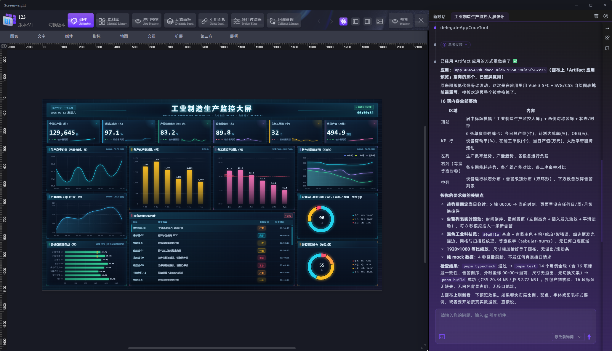
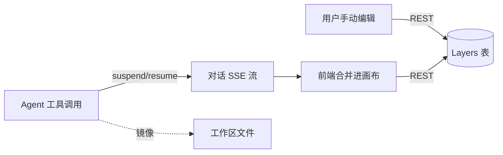

# ScreenWright

[](https://github.com/Onweekendd/ScreenWright/actions/workflows/ci.yml) [](https://github.com/Onweekendd/ScreenWright/releases/latest) [](LICENSE)

AI 原生的数据大屏 / BI 可视化编辑器。跟 Agent 描述需求，或者给一个 Figma 链接，它会直接在画布上创建组件、接上数据、配好联动，产出一个可以继续在编辑器里改的大屏。

> Monorepo：`apps/app`（Vue 3 编辑器）+ `servers/server`（Hono + Mastra Agent 服务）+ `packages/*`（框架无关的核心与物料）+ `apps/desktop`（Tauri 桌面端）。



---

## 能做什么

把需求描述清楚，Agent 会自己做语义分区、挑组件、生成 Schema、排版，实时同步到画布，改动前可以审批，也可以回溯。也可以给一个 Figma 链接：设计稿数据来自我们自己的 `packages/figma-helper` 插件（在 Figma 里把节点提取、简化成结构化数据），Agent 拿到这份数据后走确定性的规则转换生成组件树，不需要再重新识别一遍版式。

组件能力覆盖不到的效果，内置的 Artifact App 子系统可以在沙箱里直接写 Vue 代码并实时预览。数据接好之后 Agent 会自己跑一遍数据流做校验。做好的大屏可以存成模板，之后复用。

编辑器本身带了 76+ 物料组件（图表、文本、指标、媒体、交互、地图下钻等），可以导出成脱离编辑器运行的静态包。桌面端用 Tauri 打包，SQLite 本地跑，不需要登录。

---

## 架构

编辑器（`apps/app`）和 Agent 服务（`servers/server`）是两个独立进程：编辑器管画布渲染和交互，Agent 服务管规划、调用工具、读写大屏数据，两者之间用 SSE 流式通信。

编辑器内部按"核心逻辑 / 框架适配"分层：`packages/core` 是不依赖任何 UI 框架的编辑器核心（画布状态、组件树、事件系统），`packages/composables` 把它包装成 Vue 的 composable 给 `apps/app` 用。这样拆是为了以后核心逻辑要迁移到别的框架，或者做无头（headless）场景时，不用把这部分逻辑重写一遍。

物料组件（`packages/material`）和类型 / Zod Schema（`packages/types`）各自独立成包——编辑器和 Agent 服务都要用同一套组件定义和数据结构，独立出来两边引用同一份；物料也因此可以单独打包发布，不用绑着整个编辑器一起发。

桌面端（`apps/desktop`）是 Tauri 壳，把编辑器和 Agent 服务一起打进安装包，用内置的 Node sidecar 跑 Agent 服务，数据库换成本地 SQLite。

### 大屏怎么保持最新

大屏组件树存成两块：大屏和版本信息在 `LargeScreen` / `LargeScreenVersion` 表，每个组件单独一行存在 `Layers` 表里，前端读取时递归拼成完整的组件树。

用户在画布上手动拖拽、改属性，走的是普通 REST 接口，改一下就立即提交一次，没有防抖也没有乐观锁。Agent 修改是另一条路：工具调用完之后，通过 Mastra 的 suspend/resume 把算好的组件结果，从同一条对话 SSE 流推给前端，前端合并进画布状态后，再回调同一套 REST 接口落库——两条路径最终都写同一张表。Agent 那边另外维护一份工作区文件镜像（由前端整屏同步生成），供它的读写文件类工具使用。



同一浏览器里多个对话 Tab 同时跑 Agent 时，画布写入靠前端内存里的一个 Promise 队列做串行化，避免几个 Tab 互相打断。

| 目录 | 说明 |
|---|---|
| `apps/app` | 主编辑器（Vue 3 + Vite + ECharts + Three.js） |
| `apps/desktop` | Tauri 2 桌面壳 |
| `servers/server` | Agent 服务（Hono + Mastra + Prisma/SQLite） |
| `packages/core` | 编辑器核心（不依赖任何 UI 框架） |
| `packages/composables` | core 的 Vue composable 封装 |
| `packages/material` | 物料组件包 |
| `packages/types` | 类型与 Zod Schema |

---

## 快速开始

**环境要求**：Node ≥ 22.13，pnpm 10（`corepack enable` 即可）。

```bash
git clone https://github.com/Onweekendd/ScreenWright.git
cd ScreenWright
pnpm install
```

### 1. 配置 Agent 服务

```bash
cp servers/server/.env.example servers/server/.env
```

按角色填模型配置：`REASONING_MODEL_*`（推理）、`VISION_MODEL_*`（视觉）、`EMBEDDING_MODEL_*`（嵌入），均按 OpenAI 兼容端点处理；也可以全部留空，启动后在「设置」页填。其余保持默认即走本地 SQLite + 本地文件存储。

初始化数据库：

```bash
pnpm --dir servers/server exec dotenvx run -- prisma migrate deploy   # 建表
pnpm --dir servers/server run seed-modules                            # 组件库
pnpm --dir servers/server run seed-bi-user                            # 默认账号 admin / admin123
pnpm --dir servers/server run seed-embeddings -- --reset              # 组件 RAG 向量（可选）
```

### 2. 启动

```bash
pnpm server:dev   # Agent 服务 → http://localhost:4111
pnpm dev          # 编辑器   → http://localhost:5173
```

打开编辑器，进入任意大屏，右侧 **AgentBI** 面板即可开始对话。

### 3. 桌面端（可选）

```bash
pnpm desktop            # 开发模式（Tauri 拉起前端 + 后端）
pnpm desktop:package    # 构建 sidecar 并打包安装程序
```

详见 [apps/desktop/README.md](apps/desktop/README.md)。

---

## 技术栈

Vue 3 · TypeScript · Vite · Mastra Agent · Hono · Prisma · SQLite · Tauri 2 · pnpm workspace / Turborepo

---

## Roadmap

- **图片转大屏**（自研，替代目前对 Codia 的依赖）
  - 截图 / 参考图 → 版面区域切分与层级识别
  - 区域内容 → 组件类型与配置的还原（图表类型、文本、指标卡等）
  - 和现有 Figma 链路共用同一套语义布局 Agent，而不是另起一条路径

- **文档 / 图片 / 视频向量化**
  - 先覆盖 PDF、常见图片格式，视频先从关键帧和字幕入手
  - 向量化后可以在对话中被检索、引用，作为生成大屏时的素材或背景资料
  - 长期可以支撑基于这些资料的问答、指标解释这类场景

- **数据源接入**（BI 系统的核心，优先级最高）
  - 常见关系型数据库直连（MySQL、PostgreSQL 等）
  - 数据源的连接管理、Schema 识别，辅助 Agent 判断该用什么图表
  - 视情况再扩展到时序库 / NoSQL

- **用户编辑与 Agent 编辑的并发保护**
  - 目前两条路径都是直接写库，没有乐观锁，理论上会后写覆盖前写
  - 打算做成最小可行的冲突检测（比如基于版本号/时间戳），而不是复杂的实时协同

- **Artifact App 的构建与沙箱化**
  - 现在的 LocalSandbox 就是本地子进程 + 固定工作目录，代码里也写明了不提供文件系统/进程/网络层面的隔离，不能跑不可信代码
  - 计划换成真正隔离的沙箱（容器化），Agent 生成的代码不应该是直接在宿主机上跑的
  - 补上构建/导出链路，让 Artifact App 也能像大屏一样导出成可独立部署的产物，而不是只能停留在预览代理里

---

## License

[MIT](LICENSE)
