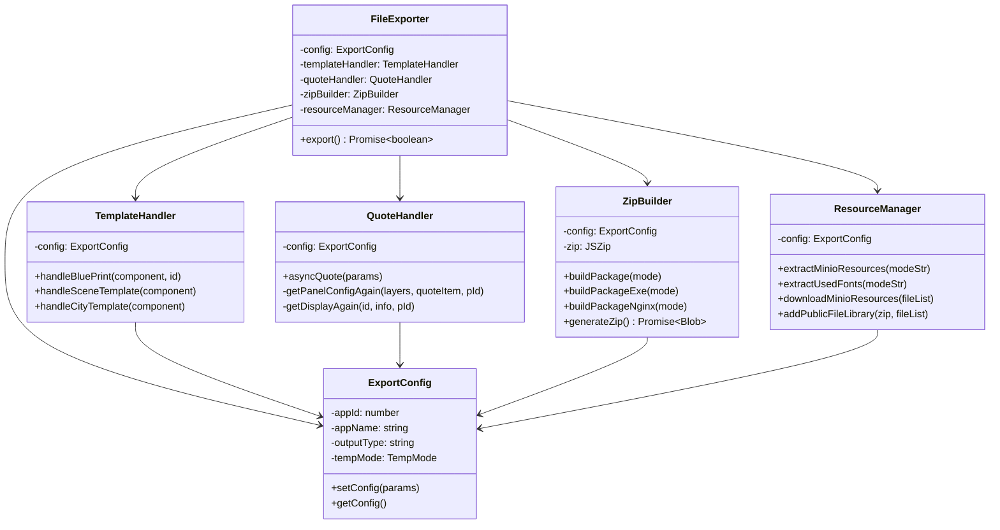

# OOP 重构 exportfile.ts 实施计划

将`apps/app/src/components/ScreenwrightList/components/templateList/exportfile.ts`使用面向对象原则重构，拆分为多个模块以提高可维护性。

## 用户审核要点

> [!IMPORTANT]
> 此重构将保持相同的公共 API（`outputExportFile`函数），但内部实现将完全重组为类结构。

> [!NOTE]
> 新的文件结构将在同一目录下创建一个`exporters`子文件夹来组织各个模块。

## 拟议变更

### 新文件结构

在`apps/app/src/components/ScreenwrightList/components/templateList/exporters/`目录下创建：

---

#### [NEW] [ExportConfig.ts](file:///c:/screenwright-monorepo/apps/app/src/components/ScreenwrightList/components/templateList/exporters/ExportConfig.ts)

导出配置类，管理导出过程中的配置状态：

- 封装`config`全局变量
- 提供配置的 getter/setter 方法
- 管理导出通知状态

---

#### [NEW] [TemplateHandler.ts](file:///c:/screenwright-monorepo/apps/app/src/components/ScreenwrightList/components/templateList/exporters/TemplateHandler.ts)

模板处理器类，负责处理场景和城市模板：

- `handleSceneTemplate()` - 处理场景模板
- `handleCityTemplate()` - 处理城市模板
- `handleBluePrint()` - 处理蓝图事件

---

#### [NEW] [QuoteHandler.ts](file:///c:/screenwright-monorepo/apps/app/src/components/ScreenwrightList/components/templateList/exporters/QuoteHandler.ts)

引用面板处理器类：

- `asyncQuote()` - 异步获取引用面板配置
- `getPanelConfigAgain()` - 递归获取嵌套引用
- `getDisplayAgain()` - 获取显示列表
- 使用 Promise.all 替代全局计数器同步

---

#### [NEW] [ZipBuilder.ts](file:///c:/screenwright-monorepo/apps/app/src/components/ScreenwrightList/components/templateList/exporters/ZipBuilder.ts)

Zip 包构建器类：

- `buildPackage()` - 构建普通包
- `buildPackageExe()` - 构建 EXE 包
- `buildPackageNginx()` - 构建 Nginx 包
- `addCommonFiles()` - 添加公共文件
- `generateInstructionText()` - 生成说明文档
- `generateComponentsExcel()` - 生成组件 Excel

---

#### [NEW] [ResourceManager.ts](file:///c:/screenwright-monorepo/apps/app/src/components/ScreenwrightList/components/templateList/exporters/ResourceManager.ts)

资源管理器类：

- `extractMinioResources()` - 提取 Minio 资源路径
- `extractUsedFonts()` - 提取使用的字体
- `downloadMinioResources()` - 下载 Minio 资源
- `addPublicFileLibrary()` - 添加本地资源库
- `getPackageAssetsDir()` - 获取资源目录路径

---

#### [NEW] [FileExporter.ts](file:///c:/screenwright-monorepo/apps/app/src/components/ScreenwrightList/components/templateList/exporters/FileExporter.ts)

主导出器类，协调所有组件：

- 组合`TemplateHandler`、`QuoteHandler`、`ZipBuilder`、`ResourceManager`
- 提供`export()`主方法 orchestrate 整个导出流程
- 管理导出进度通知

---

### 修改现有文件

#### [MODIFY] [exportfile.ts](file:///c:/screenwright-monorepo/apps/app/src/components/ScreenwrightList/components/templateList/exportfile.ts)

精简为入口文件：

- 导入`FileExporter`类
- 保留`outputExportFile`函数作为公共 API
- 函数内部实例化`FileExporter`并调用`export()`方法

```typescript
// 简化后的结构
export const outputExportFile = async (configParam: ExportParams) => {
  const exporter = new FileExporter(configParam);
  return await exporter.export();
};

// 保留 downloadFileForOffline 导出以保持向后兼容
export { downloadFileForOffline } from "./exporters/ResourceManager";
```

---

#### [MODIFY] [type.ts](file:///c:/screenwright-monorepo/apps/app/src/components/ScreenwrightList/components/templateList/type.ts)

添加新的接口定义：

- `ITemplateHandler` - 模板处理器接口
- `IQuoteHandler` - 引用处理器接口
- `IZipBuilder` - Zip 构建器接口
- `IResourceManager` - 资源管理器接口

## 类设计详情

### 类职责分配



## 验证计划

### 自动化测试

- TypeScript 编译检查：`pnpm run type-check`或等效命令
- 确保没有类型错误

### 手动验证

用户需要在应用中触发导出并验证：

1. 导出流程完成无错误
2. 下载的 zip 文件结构正确
3. 包含所有预期文件（view.js, index.html, assets 等）
4. 场景模板和城市模板正确处理
5. 引用面板正确包含
6. 三种导出类型（package/package_exe/package_nginx）都能正常工作
