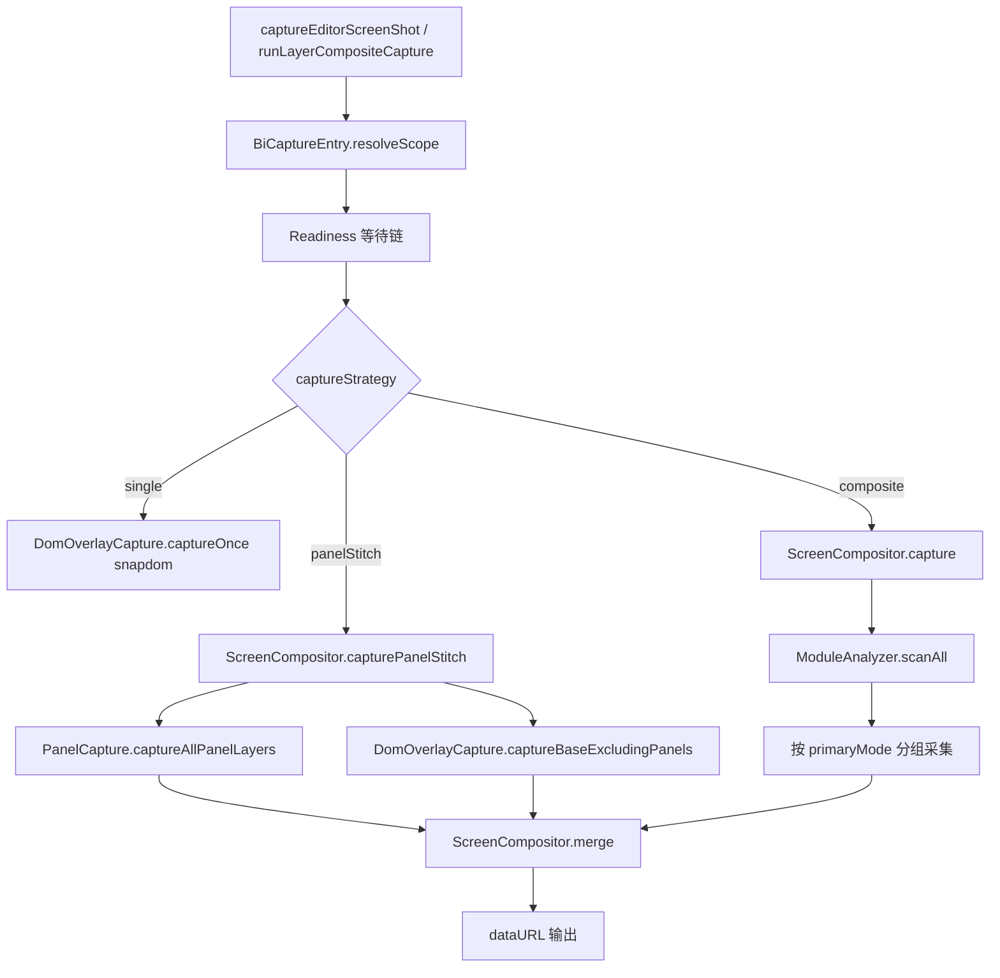
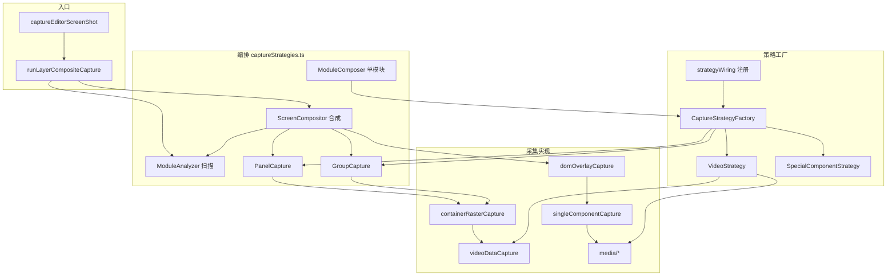

# 调用链与核心策略

> **本文档回答：** 程序怎么跑？文件之间什么关系？策略如何分发？

[← 返回索引](../README.md) · 详细参数见 [API 参考](./03-api-reference.md) · 原理见 [机制与引擎](./04-principles-and-engines.md)

---

## 核心思路（一句话）

大屏不整屏 DOM 截图，而是 **扫描 `[data-id]` 模块 → 按内容类型分层采集 → 离屏 canvas 按 zIndex 合成**。


---

## 四、对外入口 API

### 4.1 `index.ts` 导出

| 导出 | 来源 |
|------|------|
| `captureEditorScreenShot` | 构建页截图 |
| `captureEditorScreenShotWithPrompt` | 弹窗选模式后截图 |
| `promptEditorScreenShotMode` | 模式选择弹窗 |
| `runLayerCompositeCapture` | 分层截图底层 API |
| 类型 | `CaptureScope`, `LayerCaptureOptions`, `ScreenShotOptions` 等 |

---

### 4.2 `captureEditorScreenShot(options?)`

**返回：** `Promise<ScreenShotResult | null>`

| 分支 | 条件 | 行为 |
|------|------|------|
| simple | `screenShotMode === "simple"` | 对 `canvas` 直接 `snapdom.toCanvas`（scale=1, fast=true） |
| full | 默认 | 调用 `runLayerCompositeCapture({ captureStrategy: "composite", mode: "editor" })` |

**simple 模式参数：** 仅需 `canvas`（必填）和 `mimeType`。

**full 模式参数：** `canvas`, `editor`, `componentList`, `mimeType`。

---

### 4.3 `captureEditorScreenShotWithPrompt(options?)`

**返回：** `Promise<ScreenShotResult | null>`

1. 调用 `promptEditorScreenShotMode()` 弹窗
2. 用户关闭 → `null`
3. 否则合并 `screenShotMode` 调用 `captureEditorScreenShot`

---

### 4.4 `promptEditorScreenShotMode()`

**返回：** `Promise<"full" | "simple" | null>`

ElMessageBox 二选一；取消返回 `null`。

---

### 4.5 `runLayerCompositeCapture(options?)`

**返回：** `Promise<string | null>`（dataURL，无 File 包装）

**执行步骤：**

1. 设置 `CFG.delay`（editor 800 / preview 4000）
2. 清空 `VideoNormal._playbackRestoreQueue`
3. `BiCaptureEntry.resolveScope(options)` → `CaptureScope`
4. `BiCaptureEntry.markCaptureWrapper(scope.canvas)` → 截图结束还原
5. **Readiness 等待链**（见 §7.3）
6. 按 `captureStrategy` 分发：
   - `panelStitch` → `ScreenCompositor.capturePanelStitch`
   - `single`（无面板）→ `DomOverlayCapture.captureOnce`（snapdom）
   - `single`（有面板）→ 降级 panelStitch
   - `composite` → `ScreenCompositor.capture`
7. `finally`：`VideoNormal.restoreAfterCapture()` + 移除 wrapper 标记

---


---

## 五、全流程（入口 → 分析 → 采集 → 合成）

### 5.1 顶层流程图



### 5.2 ModuleAnalyzer 扫描

**`scanAll(viewWrapper, zMap, componentList)`**

1. 在 `.es-editor` 下查全部可见 `[data-id]`
2. 只保留**叶子 host**（不被其他 host 包含）
3. 跳过：`DomOverlayCapture.isCaptureUiHost`、面板内层 host、组内层 host（组只保留外壳）
4. 对每个 host 调用 `buildModuleDescriptor` → `ModuleDescriptor[]`（最多 `CFG.maxLayers` 个）

**`resolvePrimaryMode(host, box, hostId, componentList)` 优先级：**

| primaryMode | 判定条件 |
|-------------|----------|
| `panelShell` | `PanelCapture.isPanelHost` |
| `groupShell` | `GroupCapture.isGroupHost` |
| `streamVideo` | UE PixelStreaming |
| `normalVideo` | 普通 video 且无 chart/svg/混合文本 |
| `image` | 仅栅格图，无文本/图表/流送 |
| `composite` | 文本、subtabs、表格或多类型混合 |

**`groupByPrimaryMode(modules)`** 返回 `{ streamVideo, normalVideo, panelShell, groupShell, image, composite }`。

**`computeUiZ(nonStreamModules, streamModules)`** 计算 UI overlay 层的 zIndex：取非流送模块最大 z + 1，与流送最小 z 取较大值。

---

### 5.3 composite 模式采集顺序

`ScreenCompositor.capture(viewWrapper, root, zMap, componentList, outMime)`

| 阶段 | 对象 | 方法 | 产出 |
|------|------|------|------|
| ① | streamVideo + normalVideo | `VideoStrategy.buildLayer` | 独立 video/UE 层 |
| ② | groupShell | `GroupCapture.buildLayer` | 组 data 栅格层 |
| ③ | complexModules | `SpecialComponentStrategy.buildLayers` | 特殊组件层 |
| ④ | domOverlayTargets | `DomOverlayCapture.captureOverlay` | 整屏 UI 层（exclude 已成功层） |
| ⑤ | image（可选） | `ImageCapture.buildExtractedLayers` | 纯图独立层 |
| ⑥ | — | `ScreenCompositor.merge` | 最终 PNG |

**domOverlayTargets 排除规则：** 不含 streamVideo/normalVideo/groupShell；`useExtractImageLayers` 时 image 也排除；特殊组件已成功栅格的 exclude。

**降级：** overlay 失败 → 逐模块 `ModuleComposer.captureModule`；全部失败 → `captureFallback` 整屏。

---

### 5.4 panelStitch 模式

`ScreenCompositor.capturePanelStitch(scope, componentList, zMap, outMime)`

1. `CaptureTreeWalker.buildEditorCapturePlan` — 打日志用
2. 无面板 → `DomOverlayCapture.captureOnceHtml2Canvas`
3. 有面板：
   - `PanelCapture.captureAllPanelLayers` — 每面板独立层（data 栅格 / snapdom）
   - `DomOverlayCapture.captureBaseExcludingPanels` — html2canvas 底图（隐藏面板 DOM）
4. `merge(baseLayer + panelLayers)`

---

### 5.5 单模块策略链

`ModuleComposer.captureModule` → `CaptureStrategyFactory.captureModule`

**注册顺序（`strategyWiring.ts`，matches 优先级从高到低）：**

| # | kind | matches | capture |
|---|------|---------|---------|
| 1 | panel | panelShell 或 isPanelHost | `PanelCapture.buildLayer` |
| 2 | group | groupShell 且非 panel | `GroupCapture.buildLayer`（失败回退 perComponent） |
| 3 | special | `hostHasSpecialMarker` | `SpecialComponentStrategy.capture` |
| 4 | video | 含 video 且非 panel/group | `VideoStrategy` 按 VideoKind 路由 |
| 5 | fontDom | 文本 DOM 为主 | `DomOverlayCapture.capturePerComponent` |
| 6 | dom | 兜底 | `DomOverlayCapture.capturePerComponent` |

**纯图例外：** `primaryMode === "image"` 在 `ModuleComposer` 内直接 `ImageCapture.buildExtractedLayers`，不走 Factory。

---

### 5.6 合成 merge

`ScreenCompositor.merge(layers, designSize, outMime)`

| 参数 | 含义 |
|------|------|
| `layers` | 全部 CaptureLayer |
| `designSize` | 设计稿尺寸 |
| `outMime` | `"image/png"` 或 `"image/jpeg"` |

**绘制规则：**
- 输出 canvas 尺寸 = `designSize × min(2, DPR)`
- 背景填充 `CFG.backgroundColor`
- 按 `zIndex` 升序绘制
- `kind === "ue"` → `Geometry.drawImageCover` 铺满
- `kind === "ui"` → 整屏 `drawImage(0,0,outW,outH)`
- 其他 → 按 `Geometry.mapDesignRectToOutput` 精确贴图

---


---

## 功能区关系图



---

## 模块加载接线（captureStrategies.ts 末尾）

```typescript
SingleComponentCapture = createSingleComponentCapture(ImageCaptureCore)
DomOverlayCapture = createDomOverlayCapture({ imageCapture, singleComponentCapture, getPanelCapture })
ImageCapture = bindImageCaptureDomDeps(ImageCaptureCore, DomOverlayCapture)
panelCaptureRef.current = PanelCapture
wireCaptureStrategies({ PanelCapture, GroupCapture, DomOverlayCapture, ImageCapture, Readiness, hostHasSpecialMarker })
```

**说明：** `ImageCapture` 与 `DomOverlayCapture` 通过工厂 + bind 打破循环依赖；`PanelCapture` 延迟注入供 `captureBaseExcludingPanels` 使用。

---

## 三种截图模式

| 模式 | 触发 | 路径 |
|------|------|------|
| **simple** | `screenShotMode: "simple"` | 整屏 snapdom，无分层 |
| **composite** | 默认 / `screenShotMode: "full"` | 扫描 → 多策略 → merge |
| **panelStitch** | `captureStrategy: "panelStitch"` | 面板独立层 + 底图 html2canvas |
| **single** | `captureStrategy: "single"` | 无面板时 snapdom 整屏 |

---

## ContentStrategies 注册表

`captureStrategies.ts` 中的 `ContentStrategies` 对象引用各采集实现：

| 键 | 实现 | 层级 |
|----|------|------|
| `singleComponent` | SingleComponentCapture | 单盒内容补丁 |
| `videoStream` | UeStreamCapture | UE 独立层 |
| `videoNormal` | VideoNormal | 普通 video |
| `chart` | ChartCapture | ECharts 快照 |
| `image` | ImageCapture | 纯图栅格 |
| `textDom` | FontDomCapture | 文本 flatten |
| `domOverlay` | DomOverlayCapture | html2canvas 盒/层 |

---

## 策略原理概要

详细机制见 [机制与引擎](./04-principles-and-engines.md)。

| 策略 | 核心文件 | 一句话 |
|------|----------|--------|
| Video 数据层 | `videoDataCapture.ts` | 从 componentList URL 离屏抓帧 |
| 面板/组栅格 | `containerRasterCapture.ts` | 按 panelData/children 坐标离屏 drawImage |
| DomOverlay | `domOverlayCapture.ts` | sanitize → html2canvas + onClone 补丁链 |
| 纯图 | `imageCapture.ts` | 直接 drawImage img/bg，失败才 dom 回退 |
| 特殊组件 | `specialComponentStrategy.ts` | 独立栅格后从 overlay exclude |
