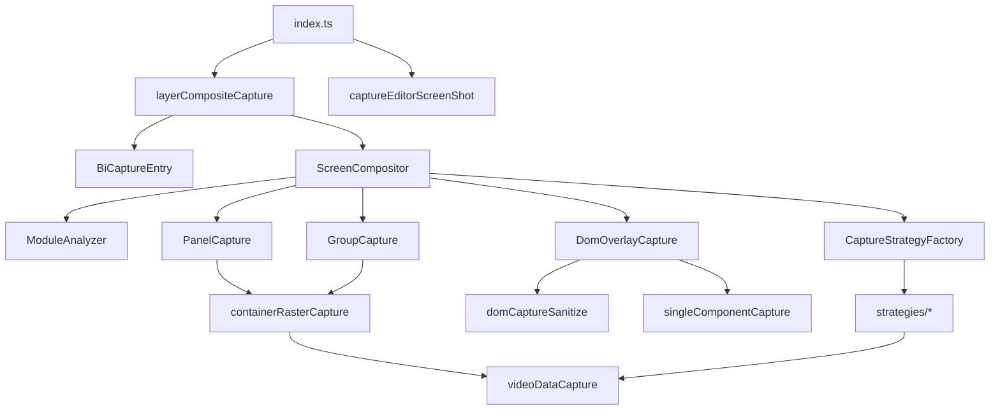

# API / 配置 / 类型详细参考

> **本文档回答：** 每个参数、函数干什么？如何安全改代码不破坏现有行为？

[← 返回索引](../README.md) · 流程见 [调用链](./02-flow-and-strategies.md)

---

## 二、类型与数据结构

### 2.1 对外类型（`types/index.ts`）

#### `CaptureElementRef`
```typescript
type CaptureElementRef = string | HTMLElement;
```
- `string`：CSS 选择器或 `#id`
- `HTMLElement`：直接传入 DOM 节点

#### `CaptureScope` — 截图作用域
| 字段 | 类型 | 含义 |
|------|------|------|
| `root` | `HTMLElement` | 根容器（通常与 canvas 相同或 `.bi-view`） |
| `canvas` | `HTMLElement` | 缩放容器（`.view-wrapper` 或 `#go-chart-edit-content`） |
| `editor` | `HTMLElement` | 组件编辑区（`.es-editor`） |
| `designSize` | `{ width, height }` | 设计稿尺寸（像素） |

#### `LayerCaptureOptions` — `runLayerCompositeCapture` 入参
| 字段 | 类型 | 默认 | 含义 |
|------|------|------|------|
| `componentList` | `ComponentList` | `[]` | 大屏组件树 JSON |
| `mode` | `"editor" \| "preview"` | `"editor"` | editor=构建页；preview=预览页 |
| `root` | `CaptureElementRef` | — | 显式指定 root |
| `canvas` | `CaptureElementRef` | — | 显式指定 canvas（可与 root 二选一） |
| `editor` | `CaptureElementRef` | — | 显式指定 editor |
| `moduleSelector` | `string` | — | 预留：模块选择器 |
| `mimeType` | `"image/png" \| "image/jpeg"` | `"image/png"` | 输出 MIME |
| `captureStrategy` | `"composite" \| "panelStitch" \| "single"` | `"composite"` | 截图策略 |

#### `ScreenShotOptions` — 构建页封面入参
继承 `LayerCaptureOptions`（除 `mode`/`captureStrategy`），额外：
| 字段 | 类型 | 默认 | 含义 |
|------|------|------|------|
| `mimeType` | `"image/jpeg" \| "image/png"` | `"image/jpeg"` | 封面常用 jpeg |
| `fileName` | `string` | — | 预留文件名 |
| `screenShotMode` | `"full" \| "simple"` | `"full"` | full=分层合成；simple=整屏 snapdom |

#### `ScreenShotResult`
| 字段 | 类型 | 含义 |
|------|------|------|
| `dataUrl` | `string` | 图片 data URL |
| `file` | `File` | 可上传的 File 对象 |

#### `CaptureStrategyName` — 内容策略名（指纹）
`"videoStream" | "videoNormal" | "chart" | "image" | "textDom" | "domOverlay"`

---

### 2.2 内部类型（`types/captureInternal.ts`）

#### `CaptureComponentItem` — 组件树节点
| 字段 | 含义 |
|------|------|
| `id` | 组件唯一 id，对应 DOM `[data-id]` |
| `zIndex` | 层级 |
| `left`, `top` | 设计稿坐标 |
| `status` / `activeStatusId` / `activeStatus` | 面板当前激活 status |
| `children` | 组组件子项 |
| `data[]` | 数据绑定（video 的 `value`/`cover`） |
| `option` | 组件 option（url/src/cover/backgroundImage 等） |
| `component.width/height/prop` | 组件尺寸与 prop 类型 |
| `panelData[]` | 面板多 status 配置（`PanelStatusEntry`） |

#### `ModuleDescriptor` — 扫描后的单模块描述
| 字段 | 含义 |
|------|------|
| `id` | 模块 id |
| `host` | `[data-id]` 外层元素 |
| `box` | `.go-shape-box` 或 host 自身 |
| `designRect` | 在大屏设计稿上的 `{ left, top, width, height }` |
| `zIndex` | 合成层级 |
| `primaryMode` | 主采集模式（见 §5.2） |
| `strategies` | 内容指纹策略名数组 |
| `panelItem` / `groupItem` | 容器类模块的配置引用 |
| `content` | `analyzeContent` 结果 |
| `kind` | 图层 kind 提示：`ue`/`video`/`panel`/`group`/`image`/`dom` |
| `inPanel` | 是否在面板内（扫描时通常为 false） |

#### `CaptureLayer` — 合成图层
| 字段 | 含义 |
|------|------|------|
| `id` | 图层 id（通常等于模块 id 或 `__ui_overlay__`） |
| `kind` | `ue` / `ui` / `dom` / `panel` / `group` / `image` / `video` |
| `zIndex` | 绘制顺序 |
| `designRect` | 贴图位置（设计稿坐标） |
| `dataUrl` | PNG/JPEG data URL |
| `pixelW`, `pixelH` | 可选：原始 canvas 像素尺寸 |

#### `SnapshotPayload` / `SnapshotMap` — DOM 快照
```typescript
interface SnapshotPayload {
  dataUrl: string | null;  // 已抓取的像素（可能尚未就绪）
  rect: DOMRect;           // 元素视觉矩形
  tag: string;             // "img" | "bg" | "canvas" | "video" | "chart" 等
  url?: string;            // 原始 URL（img/bg/video）
}
type SnapshotMap = Map<string, SnapshotPayload>;  // key = data-h2c-capture-id 序号
type SnapshotMarkFn = (el: Element, payload: SnapshotPayload) => void;
```

#### `CapturePlanNode` — editor 捕获计划节点（panelStitch）
| 字段 | 含义 |
|------|------|------|
| `id`, `kind`, `prop`, `zIndex` | 顶层组件分类信息 |
| `contentRoot` | 面板是否找到 content root |
| `innerCount` | 面板内子项数量 |
| `childIds` | 组组件子 id 列表 |

#### `Html2CanvasOptions` / `SnapdomCaptureOptions`
| 字段 | html2canvas | snapdom |
|------|-------------|---------|
| `scale` | 渲染倍率 | 渲染倍率 |
| `width`, `height` | 输出 canvas 尺寸 | 输出 canvas 尺寸 |
| `backgroundColor` | 背景色，`null`=透明 | 同上 |
| `onClone` | 克隆后回调 `(doc, element)` | — |
| `afterCloneFn` | — | clone 完成后 `(cloneRoot, liveElement)` |
| `filter` | — | 节点过滤函数 |
| `filterMode` | — | `"remove"` 等 |

#### `CaptureModuleContext` — 模块策略上下文
| 字段 | 含义 |
|------|------|
| `module` | `ModuleDescriptor` |
| `viewWrapper` | `.view-wrapper` |
| `designSize` | 设计稿尺寸 |
| `componentList` | 组件树 |

#### `ICaptureModuleStrategy` — 模块策略接口
| 成员 | 签名 | 含义 |
|------|------|------|
| `kind` | `CaptureModuleStrategyKind` | panel/group/special/video/fontDom/dom |
| `matches(ctx)` | `boolean` | 是否由本策略处理 |
| `capture(ctx)` | `Promise<CaptureLayer \| CaptureLayer[] \| null>` | 执行采集 |

#### `RestoreFn`
```typescript
type RestoreFn = () => void;
```
截图前修改 DOM/style 后，在 `finally` 中调用以还原。

#### `StyleStashItem` — DOM 修改 stash 条目
| 字段 | 用途 |
|------|------|
| `el` | 被修改的 HTMLElement |
| `opacity/visibility/display/animation` | 样式还原 |
| `transform/webkitTransform` | transform 还原 |
| `scrollTop` | 滚动位置还原 |
| `img/video` + `src/crossOrigin` | 媒体属性还原 |
| `parent/replacement/node` | DOM 替换还原（video→img sanitize） |
| `innerHTML` | 富文本还原 |

---


---

## 三、全局配置 CFG

文件：`captureConfig.ts`

| 键 | 类型 | 默认 | 作用 |
|----|------|------|------|
| `delay` | `number` | `800` | 作用域解析后额外等待 ms（preview 模式在入口被设为 4000） |
| `loadingWait` | `number` | `60000` | 等待 loading mask / 大屏加载的最长 ms |
| `contentWaitMax` | `number` | `30000` | 复杂内容等待上限 |
| `ueWaitMax` | `number` | `20000` | UE 流送就绪等待上限 |
| `chartWaitMax` | `number` | `25000` | ECharts 就绪等待上限 |
| `poll` | `number` | `250` | 轮询间隔 ms |
| `estimateHintSec` | `number` | `22` | UI 提示预估秒数 |
| `captureAttr` | `string` | `"data-h2c-capture-id"` | 快照 DOM 标记属性名 |
| `backgroundColor` | `string` | `"#181a24"` | 合成 canvas 背景色 |
| `layerScale` | `number` | `min(2, devicePixelRatio)` | html2canvas/snapdom/栅格 canvas 渲染倍率 |
| `ueFullScreen` | `boolean` | `true` | UE 层是否按全屏 cover 绘制 |
| `fallbackFullCanvas` | `boolean` | `true` | 全部分层失败时是否整屏回退 |
| `maxLayers` | `number` | `80` | `scanAll` 最大模块数 |
| `domCaptureMode` | `string` | `"overlay"` | `"overlay"`=batch 整层 UI；其他值=逐模块 capture |
| `useExtractImageLayers` | `boolean` | `false` | 纯图是否独立栅格化并从 overlay exclude |
| `imageLoadTimeout` | `number` | `45000` | 大图加载超时 ms |

#### `CAPTURE_WRAPPER_ATTR`
值：`"data-layer-capture-wrapper"`。标记在 canvas 上，snapdom/html2canvas 克隆树中用于定位 scale 容器（替代写死 `.view-wrapper`）。

---


---

## 四、对外入口 API

### 4.1 `index.ts` 导出

| 导出 | 来源 |
|------|------|
| `captureEditorScreenShot` | 构建页截图 |
| `captureEditorScreenShotWithPrompt` | 弹窗选模式后截图 |
| `promptEditorScreenShotMode` | 模式选择弹窗 |
| `runLayerCompositeCapture` | 分层截图底层 API |
| 类型 | `CaptureScope`, `LayerCaptureOptions`, `ScreenShotOptions` 等 |

---

### 4.2 `captureEditorScreenShot(options?)`

**返回：** `Promise<ScreenShotResult | null>`

| 分支 | 条件 | 行为 |
|------|------|------|
| simple | `screenShotMode === "simple"` | 对 `canvas` 直接 `snapdom.toCanvas`（scale=1, fast=true） |
| full | 默认 | 调用 `runLayerCompositeCapture({ captureStrategy: "composite", mode: "editor" })` |

**simple 模式参数：** 仅需 `canvas`（必填）和 `mimeType`。

**full 模式参数：** `canvas`, `editor`, `componentList`, `mimeType`。

---

### 4.3 `captureEditorScreenShotWithPrompt(options?)`

**返回：** `Promise<ScreenShotResult | null>`

1. 调用 `promptEditorScreenShotMode()` 弹窗
2. 用户关闭 → `null`
3. 否则合并 `screenShotMode` 调用 `captureEditorScreenShot`

---

### 4.4 `promptEditorScreenShotMode()`

**返回：** `Promise<"full" | "simple" | null>`

ElMessageBox 二选一；取消返回 `null`。

---

### 4.5 `runLayerCompositeCapture(options?)`

**返回：** `Promise<string | null>`（dataURL，无 File 包装）

**执行步骤：**

1. 设置 `CFG.delay`（editor 800 / preview 4000）
2. 清空 `VideoNormal._playbackRestoreQueue`
3. `BiCaptureEntry.resolveScope(options)` → `CaptureScope`
4. `BiCaptureEntry.markCaptureWrapper(scope.canvas)` → 截图结束还原
5. **Readiness 等待链**（见 §7.3）
6. 按 `captureStrategy` 分发：
   - `panelStitch` → `ScreenCompositor.capturePanelStitch`
   - `single`（无面板）→ `DomOverlayCapture.captureOnce`（snapdom）
   - `single`（有面板）→ 降级 panelStitch
   - `composite` → `ScreenCompositor.capture`
7. `finally`：`VideoNormal.restoreAfterCapture()` + 移除 wrapper 标记

---


---

## 七、逐文件 API 参考

---

### 7.1 `captureConfig.ts`

| 导出 | 类型 | 说明 |
|------|------|------|
| `CFG` | object | 全局配置（见 §三） |
| `LOG` | string | `"[图层截图]"` |
| `CAPTURE_WRAPPER_ATTR` | string | `"data-layer-capture-wrapper"` |

---

### 7.2 `captureUtils.ts`

#### `Utils`

| 方法 | 参数 | 返回 | 作用 |
|------|------|------|------|
| `sleep(ms)` | 毫秒 | `Promise<void>` | 异步延时 |
| `waitFrames(n)` | 帧数 | `Promise<void>` | 等待 n 个 requestAnimationFrame |
| `isVisible(el)` | Element | `boolean` | display/visibility 非隐藏且宽高 > 2px |
| `preparePanelContentForCapture(root)` | 根节点 | `RestoreFn` | 面板渐显、滚动归零、跑马灯冻结 |
| `safeCanvasToDataUrl(canvas, mime?)` | canvas | `string\|null` | 安全导出（防 taint） |
| `escapeDataId(s)` | 任意 | `string` | CSS.escape 包装 id |
| `findHostByComponentId(viewWrapper, id)` | 容器, id | `HTMLElement\|null` | `[data-id]` / `#id` / `.go-shape-box[id]` |
| `isCanvasMostlyBlank(canvas)` | canvas | `boolean` | 采样 alpha，不透明像素 < 2% 视为空白 |
| `hasCanvasContent(canvas)` | canvas | `boolean` | 稀疏 canvas 是否有任意可见像素 |
| `log(level, ...args)` | 日志级别 | `void` | 带 LOG 前缀输出 |
| `getClonePatchContext(clonedRoot)` | Document/HTMLElement | `{ ownerDoc, queryRoot }` | snapdom 克隆树查询上下文 |
| `hideTransientOverlays(root)` | 根节点 | `RestoreFn` | 委托 EditorChrome.hideForCapture |

#### `findHostByComponentId`（独立导出）
等价于 `Utils.findHostByComponentId`。

#### `CaptureNodeKind`

| 常量 | 值 | 含义 |
|------|-----|------|
| `PANEL_DYNAMIC` | `panelDynamic` | 动态面板 |
| `PANEL_SPECIAL` | `panelSpecial` | 专题面板 |
| `PANEL_QUOTE` | `panelQuote` | 引用面板 |
| `PANEL_ENCODE` | `panelEncode` | 编码面板 |
| `GROUP` | `group` | 组 |
| `UE_STREAM` | `ueStream` | UE 流送叶子 |
| `LEAF` | `leaf` | 普通叶子 |

#### `EditorChrome`

| 成员 | 作用 |
|------|------|
| `LIVE_HIDE_SELECTORS` | 构建页脏层选择器（锚点、选中框、遮罩等） |
| `hideForCapture(root)` | live DOM 隐藏脏层，返回 RestoreFn |
| `hideInClone(clonedRoot)` | 克隆树隐藏脏层 |

#### `ComponentTreeCapture`

| 方法 | 参数 | 返回 | 作用 |
|------|------|------|------|
| `isPanelComponent(item)` | 组件项 | `boolean` | prop 是否为面板类型 |
| `getActivePanelConfigs(item)` | 面板项 | `CaptureComponentItem[][]` | 当前 status 的 config 数组 |
| `getActivePanelStatus(item)` | 面板项 | `PanelStatusEntry\|null` | 当前 status 元数据 |
| `walkComponents(items, visitor)` | 列表, 回调 | `void` | 深度遍历（含 panelData 内） |
| `buildZIndexMap(items)` | 列表 | `Map<string,number>` | 全局 zIndex（面板内子项加权） |
| `collectPanelChildComponents(items)` | 列表 | `{ item, panelItem }[]` | 收集面板内子组件 |
| `countPanelComponents(items)` | 列表 | `number` | 面板数量 |
| `findComponentById(items, id)` | 列表, id | `CaptureComponentItem\|null` | 按 id 查找 |
| `collectPanelExcludeIds(componentList)` | 列表 | `Set<string>` | 面板外+内层 id（overlay 去重用） |

#### `Geometry`

| 方法 | 参数 | 返回 | 作用 |
|------|------|------|------|
| `getCanvasDesignSize(el)` | canvas | `DesignSize` | 从 DOM 读设计稿宽高 |
| `getFullScreenDesignRect(designSize)` | 尺寸 | `DesignRect` | `{0,0,width,height}` |
| `visualRectToDesignRect(rect, wrapperRect, designSize)` | 视觉矩形 | `DesignRect` | 屏幕坐标→设计坐标 |
| `getDesignRectFromStyle(el, viewWrapper)` | 元素 | `DesignRect\|null` | 从 style 解析 |
| `mapDesignRectToOutput(designRect, designSize, outW, outH)` | 设计矩形 | `OutputBox` | 映射到输出 canvas 像素 |
| `buildZIndexMap(items)` | 列表 | `Map` | 委托 ComponentTreeCapture |
| `isInsidePanelHost(host)` | host | `boolean` | 是否在 `.ft-panel/.quote-panel` 内 |
| `resolveDesignRect(host, box, viewWrapper, wrapperRect, designSize)` | 多参数 | `DesignRect` | 综合解析（style→DOM 换算） |
| `resolveZIndex(hostId, domOrder, zMap)` | id, 序号, map | `number` | 解析 zIndex |
| `getShapeBox(host)` | host | `HTMLElement` | `.go-shape-box` 或 host |
| `drawImageCover(ctx, img, box)` | 2d 上下文 | `void` | cover 模式绘制 |

#### `CaptureUI`

| 方法 | 作用 |
|------|------|
| `createProgress()` | 创建全屏 Loading（start/close） |
| `notifyStart/Success/Error` | ElMessage 提示 |
| `notifyMissingSnapdom()` | 缺少 snapdom 错误 |
| `download(dataUrl)` | 触发浏览器下载 PNG |

#### `Html2CanvasCapture.toCanvas(element, options?)`

| options 字段 | 默认 | 作用 |
|--------------|------|------|
| `scale` | `CFG.layerScale` | 渲染倍率 |
| `width`, `height` | 元素尺寸 | 输出 canvas 尺寸 |
| `backgroundColor` | `CFG.backgroundColor` | 背景，`null`=透明 |
| `onClone` | — | `(clonedDoc, element) => void` 克隆后 patch |

html2canvas 选项：`useCORS: true`, `allowTaint: false`, `imageTimeout: 15000`。

#### `SnapdomCapture`

| 方法 | 作用 |
|------|------|
| `createAfterClonePlugin(fn)` | 包装 afterClone 为 snapdom plugin |
| `toCanvas(element, options?)` | snapdom 截图，`embedFonts: true` |
| `createExcludeFilter(excludeHostIds?)` | 排除面板/指定 host 的 filter |

---

### 7.3 `core/biCaptureEntry.ts` — `BiCaptureEntry`

| 成员 | 参数 | 返回 | 作用 |
|------|------|------|------|
| `selectors` | — | object | `{ root: ".bi-view", canvas: ".view-wrapper", editor: ".es-editor", module: "[data-id]" }` |
| `resolveElement(ref, label)` | 引用, 标签 | `HTMLElement` | 解析选择器或节点，找不到抛错 |
| `resolveEditorElement(canvas, editorRef?)` | canvas, 可选 editor | `HTMLElement` | 解析 editor |
| `buildScope(root, canvas, editor)` | 三者 | `CaptureScope` | 校验 canvas 可见，取 designSize |
| `resolvePreview()` | — | `Promise<CaptureScope>` | 预览页：等 loading → 找 .bi-view/.view-wrapper |
| `resolveScope(options)` | LayerCaptureOptions | `Promise<CaptureScope>` | 统一入口：显式入参 > preview > editor |
| `markCaptureWrapper(canvas)` | canvas | `RestoreFn` | 设置 CAPTURE_WRAPPER_ATTR |
| `findScaledWrapperInClone(clonedRoot, liveViewWrapper)` | 克隆根, live wrapper | `HTMLElement\|null` | 克隆树找 scale 容器 |
| `patchScaledWrapperInClone(clonedWrapper, designSize)` | wrapper, 尺寸 | `void` | transform=none，设设计稿宽高 |

---

### 7.4 `core/readiness.ts` — `Readiness`

| 方法 | 参数 | 返回 | 作用 |
|------|------|------|------|
| `waitLoadingGone()` | — | `Promise<void>` | 等 `#screenwright-loading-mask` 等消失 |
| `waitCaptureTargets()` | — | `Promise<{root,canvas}>` | 等 .bi-view + .view-wrapper 可见 |
| `waitFonts()` | — | `Promise<void>` | `document.fonts.ready` |
| `waitImagesReady(root, timeoutMs?)` | 根, 超时 | `Promise<void>` | 等可见 img 加载完成 |
| `waitComplexDomReady(root)` | 根 | `Promise<void>` | 等特殊组件 DOM 就绪 |
| `waitPageContentReady(root)` | 根 | `Promise<void>` | 预览页：UE + 图表 |
| `waitPanelContentReady(root, componentList)` | 根, 列表 | `Promise<void>` | 等面板子项渲染 |
| `prepare()` | — | `Promise<targets>` | 综合：loading→targets→fonts→charts→page |

---

### 7.5 `analysis/*`

#### `CaptureNodeClassifier`

| 方法 | 参数 | 返回 | 作用 |
|------|------|------|------|
| `classify(item, host)` | 组件项, host | CaptureNodeKind 字符串 | panel 子类型 / group / ueStream / leaf |
| `isPanelKind(kind)` | kind | `boolean` | 是否四种 panel kind 之一 |

#### `PanelEntryResolver`

| 方法 | 参数 | 返回 | 作用 |
|------|------|------|------|
| `getContentRoot(host, kind, panelProp)` | host, kind, prop | `Element\|null` | 动态→status-view；引用→screen-quote；专题→panel-view |

#### `CaptureTreeWalker`

| 方法 | 参数 | 返回 | 作用 |
|------|------|------|------|
| `isPanelInnerItem(item, componentList)` | 项, 列表 | `boolean` | 是否在 panelData 内（不应顶层单独截） |
| `listEditorTopLevelItems(componentList)` | 列表 | `CaptureComponentItem[]` | 过滤 panel 内层的顶层项 |
| `buildEditorCapturePlan(editor, componentList, viewWrapper)` | 三者 | `CapturePlanNode[]` | 构建捕获计划并打日志 |

---

### 7.6 `capture/singleComponentCapture.ts`

#### `createSingleComponentCapture(imageCapture: ImageCaptureApi)`

| 返回方法 | 参数 | 作用 |
|----------|------|------|
| `analyze(host, box)` | host, box | 返回 `{ pixelStream, normalVideo, echarts, canvas, webglCanvas, image, textDom, svg }` |
| `collectNativeCanvasSnapshots(root, snapshots, mark)` | 根, map, 标记函数 | 非 echarts 的 canvas.toDataURL |
| `collectChartAndCanvasSnapshots(root, snapshots, mark)` | 同上 | ChartCapture + native canvas |
| `applyMediaPatchesOnClone(clonedDoc, snapshots, liveRoot?)` | 克隆, 快照 | chart/video/img/svg 补丁 |
| `patchClone(clonedDoc, liveRoot, snapshots)` | 克隆, live, 快照 | media + 3D + 文本 flatten |

#### `ImageCaptureApi`（`media/imageCaptureTypes.ts`）
`detectInHost`, `hasNonRasterContent`, `applyBgSnapshotsOnClone`, `applyImgSnapshotsOnClone`

---

### 7.7 `capture/strategyWiring.ts`

#### `wireCaptureStrategies(deps: StrategyWiringDeps)`

**deps 字段：**

| 字段 | 需实现的方法 |
|------|-------------|
| `PanelCapture` | `isPanelHost`, `buildLayer` |
| `GroupCapture` | `isGroupComponent`, `buildLayer` |
| `DomOverlayCapture` | `prepareWrapper`, `buildSnapshotsAsync`, `applyLiveMediaPatches`, `applyMediaPatchesOnClone`, `capturePerComponent` |
| `ImageCapture` | `applyCrossOriginOnLive` |
| `Readiness` | `waitImagesReady` |
| `hostHasSpecialMarker` | `(host) => boolean` |

**内部构建：**
- `isPanelModule(ctx)` / `isGroupModule(ctx)` 判定函数
- `videoCaptureEngine` — 注入 UeStream/VideoNormal/VideoDataCapture
- 注册 Special → Video → FontDom → Panel → Group → Dom 到 `CaptureStrategyFactory`

**返回：** `{ isPanelModule, isGroupModule }`

---

### 7.8 `dom/captureDomHelpers.ts`

| 导出 | 签名 | 作用 |
|------|------|------|
| `StyleStashItem` | interface | DOM 修改 stash 结构（见 §2.2） |
| `errMsg(error)` | `unknown → string` | Error.message 或 String |
| `castHtml(el)` | `Element → HTMLElement` | 类型断言 |
| `castVideo(el)` | `Element → HTMLVideoElement` | 类型断言 |
| `asDoc(root)` | `Document\|HTMLElement → Document` | 归一化为 Document |
| `canvasCtx(canvas)` | `HTMLCanvasElement → CanvasRenderingContext2D` | getContext("2d")! |

---

### 7.9 `dom/domCaptureSanitize.ts`

#### `runDomCaptureSanitizePipeline(options: DomCaptureSanitizeOptions)`

| 参数字段 | 类型 | 默认 | 作用 |
|----------|------|------|------|
| `root` | `HTMLElement` | 必填 | sanitize 根节点 |
| `componentList` | `ComponentList` | 必填 | 传给 buildSnapshotsAsync |
| `deps` | `DomSanitizeLiveDeps` | 必填 | 快照与 live patch 依赖 |
| `sanitizeVideo` | `boolean` | `true` | 是否 video→img 替换 |
| `sanitizeImg` | `boolean` | `true` | 是否 img CORS sanitize |

**返回 `DomCaptureSanitizeSession`：**
- `snapshots: SnapshotMap`
- `restore(): void` — 必须在 finally 调用

---

### 7.10 `dom/domOverlayCapture.ts`

#### `createDomOverlayCapture(deps: DomOverlayCaptureDeps)`

**deps：**
| 字段 | 作用 |
|------|------|
| `imageCapture` | ImageCaptureCore（快照/img patch） |
| `singleComponentCapture` | 单组件补丁管线 |
| `getPanelCapture?` | 延迟获取 PanelCapture（hideForLiveCapture/hideInClone） |

**返回对象全部方法：**

| 方法 | 参数 | 返回 | 作用 |
|------|------|------|------|
| `isCaptureUiHost(host)` | host | `boolean` | 是否截图 UI 自身 |
| `prepareWrapper(viewWrapper, designSize)` | wrapper, 尺寸 | `RestoreFn` | 去 scale，设设计稿尺寸 |
| `buildSnapshots(root)` | root | `{ snapshots, mark }` | 同步 chart/canvas 快照 |
| `buildSnapshotsAsync(root, componentList)` | root, 列表 | `Promise<SnapshotMap>` | + video/img/bg 异步快照 |
| `clearMarks(root)` | root | `void` | 清除 captureAttr 标记 |
| `applyMediaPatchesOnClone(clonedDoc, snapshots, liveRoot?)` | 克隆, 快照 | `void` | 委托 SingleComponentCapture |
| `applyLiveMediaPatches(root, snapshots)` | root, 快照 | `RestoreFn` | video 帧 + img src live patch |
| `getDomSanitizeDeps()` | — | `DomSanitizeLiveDeps` | 供 sanitize 流水线 |
| `hideHostsInClone(clonedDoc, hostIds)` | doc, id 集合 | `void` | 克隆树隐藏指定 host |
| `hideHostsOnLive(root, hostIds)` | root, id 集合 | `RestoreFn` | live 隐藏指定 host |
| `buildOverlayOnclone(snapshots, designSize, excludeHostIds, liveViewWrapper)` | 多参数 | `onClone fn` | overlay 专用 onClone 链 |
| `captureOverlay(viewWrapper, designSize, zIndex, excludeHostIds, componentList)` | 多参数 | `Promise<CaptureLayer\|null>` | **batch UI 整层** html2canvas |
| `capturePerComponent(descriptor, viewWrapper, designSize, componentList)` | 模块描述 | `Promise<CaptureLayer\|null>` | **单模块** html2canvas |
| `buildHtml2CanvasOnclone(liveCanvas, designSize, snapshots, extraCloneFn?)` | 多参数 | `onClone fn` | 整屏 onClone 链 |
| `captureOnceHtml2Canvas(scope, outMime, componentList)` | 作用域 | `Promise<string\|null>` | 整屏 html2canvas 一次 |
| `captureOnce(scope, outMime, componentList)` | 作用域 | `Promise<string\|null>` | 整屏 **snapdom** 一次（sanitize 关 video/img） |
| `captureFallback(viewWrapper, componentList)` | wrapper, 列表 | `Promise<string\|null>` | 整屏回退 html2canvas |
| `captureBaseExcludingPanels(scope, outMime, componentList)` | 作用域 | `Promise<string\|null>` | panelStitch 底图（隐藏面板） |

---

### 7.11 `media/videoNormal.ts` — `VideoNormal`

| 方法 | 参数 | 返回 | 作用 |
|------|------|------|------|
| `getVideos(root)` | root | `HTMLVideoElement[]` | 非流送可见 video |
| `detectInHost(host)` | host | `boolean` | 是否有普通 video |
| `applyCrossOriginOnLive(root)` | root | `RestoreFn` | 未加载 video 设 crossOrigin |
| `_playbackRestoreQueue` | — | `VideoPlaybackEntry[]` | 播放恢复队列 |
| `snapshotPlaybackState(root)` | root | entries | 记录播放状态 |
| `queuePlaybackRestore(entries)` | entries | `void` | 入队 |
| `restoreAfterCapture()` | — | `Promise<void>` | 截图结束后恢复播放 |
| `pauseAllForCapture(root)` | root | entries | 暂停并入队 |
| `collectSnapshots(root, snapshots, mark, componentList)` | 多参数 | `Promise<void>` | 收集 video 帧到 SnapshotMap |
| `applySnapshotsOnClone(clonedDoc, snapshots)` | 克隆, 快照 | `void` | clone 中 video→img |
| `applyLiveFramePatches(root, snapshots)` | root, 快照 | `RestoreFn` | live video→img |
| `buildLayer(descriptor, designSize, componentList)` | 模块 | `Promise<CaptureLayer\|null>` | video 独立层 |
| `waitReady(root)` | root | `Promise<void>` | 等 video 有有效帧 |
| `ensurePlaying(root)` | root | `Promise<void>` | 尝试 play() |
| `hideForLiveCapture(root)` | root | `RestoreFn` | live 隐藏 video |
| `hideInClone(clonedDoc)` | doc | `void` | clone 隐藏 video |

---

### 7.12 `media/ueStreamCapture.ts` — `UeStreamCapture`

| 方法 | 参数 | 返回 | 作用 |
|------|------|------|------|
| `isStreamVideoElement(video)` | video | `boolean` | 是否 UE/像素流 video |
| `getStreamVideos(root)` | root | `HTMLVideoElement[]` | 流送 video 列表 |
| `getVideos(root)` | root | `HTMLVideoElement[]` | 含 legacy 选择器 |
| `isHost(host)` | host | `boolean` | 是否 UE host |
| `isVideoFrameBlank(video)` | video | `boolean` | 帧是否几乎全黑 |
| `isReady(root)` | root | `boolean` | 流送 video 是否就绪 |
| `captureVideoDataUrl(video)` | video | `string\|null` | drawImage 抓 UE 帧 |
| `isNearFullScreen(designRect, designSize)` | 矩形, 尺寸 | `boolean` | 是否近全屏 |
| `buildLayer(descriptor, designSize)` | 模块, 尺寸 | `CaptureLayer\|null` | UE 独立层 |
| `hideForLiveCapture(root)` | root | `RestoreFn` | 隐藏 UE 容器 |
| `hideInClone(clonedDoc)` | doc | `void` | clone 隐藏 UE |

---

### 7.13 `media/chartCapture.ts` — `ChartCapture`

| 方法 | 参数 | 返回 | 作用 |
|------|------|------|------|
| `getHosts(root)` | root | `HTMLElement[]` | 可见 echarts host |
| `isHostReady(host)` | host | `boolean` | echarts/canvas 是否就绪 |
| `waitReady(root)` | root | `Promise<void>` | 等待并 resize 图表 |
| `collectSnapshots(root, snapshots, mark)` | 根, map, mark | `void` | echarts.getDataURL |
| `applySnapshotsOnClone(clonedDoc, snapshots)` | 克隆, 快照 | `void` | chart→img 替换 |

---

### 7.14 `media/imageCapture.ts`

#### `ImageCaptureCore` 全部方法

| 方法 | 参数 | 返回 | 作用 |
|------|------|------|------|
| `extractUrlFromBgImage(bgImage)` | CSS background-image | `string\|null` | 解析 url() |
| `load(src, timeoutMs?, useCors?)` | URL | `Promise<HTMLImageElement\|null>` | 加载图片 |
| `normalizeImgSrc(src)` | src | `string` | minio 规范化 |
| `loadAsDataUrl(src)` | src | `Promise<string\|null>` | 加载并转 dataURL |
| `resolveImgSrc(imgEl)` | img | `string` | currentSrc/src 规范化 |
| `resolvePatchSrc(payload, imgEl?)` | 快照, 可选 img | `string` | 截图用最终 src |
| `syncImgStylesFromLive(liveEl, targetEl, rect?)` | live, target | `void` | 同步 img 样式 |
| `ensureAllImgSrcReady(root)` | root | `void` | 规范化并可见化所有 img |
| `applyLiveImgPatches(root, snapshots)` | root, 快照 | `RestoreFn` | live img src patch |
| `captureElementToDataUrl(imgEl)` | img | `string\|null` | drawImage 抓帧 |
| `pushLayer(layers, layer)` | 数组, 层 | `void` | 非空 dataUrl 才 push |
| `hasNonRasterContent(host)` | host | `boolean` | 是否含 video/chart/文本等 |
| `isImageOnlyModule(module)` | ModuleDescriptor | `boolean` | 是否纯图模块 |
| `detectInHost(host, box)` | host, box | `boolean` | 是否可抽取栅格图 |
| `shouldSnapshotBgElement(el)` | el | `boolean` | 是否应对该元素抓 bg |
| `collectBgElementSnapshots(root, snapshots, mark)` | 根, map, mark | `Promise<void>` | 收集 background-image 快照 |
| `collectImgSnapshots(root, snapshots, mark)` | 根, map, mark | `Promise<void>` | 收集 img 快照 |
| `applyBgSnapshotsOnClone(clonedDoc, snapshots)` | 克隆, 快照 | `void` | bg→dataURL 贴回 clone |
| `applyImgSnapshotsOnClone(clonedDoc, snapshots, liveRoot?)` | 克隆, 快照 | `void` | img src 贴回 clone |
| `getModuleIdsFromLayers(layers)` | 层数组 | `Set<string>` | 从 layer id 反查模块 id |
| `buildLayersForDescriptor(d, viewWrapper, designSize, wrapperRect, baseZ, captureHostViaDom)` | 多参数 | `Promise<CaptureLayer[]>` | 单模块纯图多层 |
| `applyCrossOriginOnLive(root)` | root | `RestoreFn` | 未加载 img 设 crossOrigin |

#### `bindImageCaptureDomDeps(core, domOverlay)`

额外绑定：
| 方法 | 作用 |
|------|------|
| `captureHostViaDom(d, viewWrapper, designSize, wrapperRect, baseZ)` | 纯图 html2canvas 单盒回退 |
| `buildExtractedLayers(imageDescriptors, viewWrapper, designSize)` | 批量纯图层 |
| `buildLayersForDescriptor(...)` | 包装版（内置 captureHostViaDom） |

---

### 7.15 `videoDataCapture.ts`

| 导出 | 参数 | 返回 | 作用 |
|------|------|------|------|
| `VIDEO_COMPONENT_PROPS` | — | `Set<string>` | `ftvideo/ft-video/ftVideo` |
| `isVideoComponentItem(item)` | 组件项 | `boolean` | 是否 video 组件 |
| `isDefaultDemoVideoUrl(url)` | URL | `boolean` | 是否默认演示视频 |
| `normalizeVideoMediaUrl(raw)` | raw | `string\|null` | 规范化（过滤 ws/blob） |
| `resolveConfiguredVideoUrl(item)` | 项 | `string` | data[0].value / option.url |
| `resolveCoverUrl(item)` | 项 | `string\|null` | cover / backgroundImage |
| `captureFromConfiguredUrl(rawUrl, seekTime?)` | URL, seek | `Promise<string\|null>` | 离屏抓帧 |
| `captureFromComponentItem(item, seekTime?)` | 项 | `Promise<string\|null>` | 从组件项抓帧 |
| `captureFromComponentId(hostId, componentList, seekTime?)` | id, 列表 | `Promise<string\|null>` | 从 id 抓帧 |
| `captureVideoDataUrl(options)` | VideoCaptureOptions | `Promise<string\|null>` | **统一入口** |
| `resolveVideoHostId(video)` | video | `string\|null` | 从 video 元素解析 hostId |
| `captureVideoFromElement(video, componentList)` | video, 列表 | `Promise<string\|null>` | DOM video 抓帧 |
| `captureContainerChildVideo(child, componentList, host?, seekTime?)` | 子项 | `Promise<string\|null>` | 面板/组内 video |
| `VideoDataCapture` | object | — | 上述函数聚合 |

#### `VideoCaptureOptions`
| 字段 | 类型 | 必填 | 作用 |
|------|------|------|------|
| `componentId` | `string\|number` | ✓ | 组件 id |
| `componentList` | `ComponentList` | ✓ | 组件树 |
| `seekTime` | `number` | | 视频 seek 秒数，默认 0 |
| `host` | `HTMLElement` | | 用于 previewImg 查找 |

---

### 7.16 `corsMediaFallback.ts` — `CorsMediaFallback`

| 方法 | 参数 | 返回 | 作用 |
|------|------|------|------|
| `fetchAsDataUrl(rawUrl, timeoutMs?)` | URL | `Promise<string\|null>` | fetch→blob→dataURL |
| `fetchAsBlob(rawUrl, timeoutMs?)` | URL | `Promise<Blob\|null>` | CORS fetch blob |
| `loadImageAsDataUrl(rawUrl)` | URL | `Promise<string\|null>` | 图片多路径转 dataURL |
| `captureFrameFromVideoElement(video)` | video | `Promise<string\|null>` | 从播放中 video 抓帧 |
| `loadVideoFrameAsDataUrl(rawUrl, seekTime?)` | URL | `Promise<string\|null>` | 离屏 video 抓帧 |
| `applyLiveVideoSanitize(root, captureFrame?)` | root, 回调 | `Promise<RestoreFn>` | live video→img 替换 |
| `safeCanvasToDataUrl(canvas, mimeType?)` | canvas | `string\|null` | 防 taint 导出 |
| `applyLiveImgSanitize(root)` | root | `Promise<RestoreFn>` | img src 转 dataURL |

---

### 7.17 `transform3dCapture.ts` — `Transform3DCapture`

| 成员 | 作用 |
|------|------|
| `CONTAINER_SELECTOR` | 3D/动画容器选择器字符串 |
| `shouldFreeze(el)` | 是否需冻结动画/transform |
| `hasMatrix3d(el)` | 是否有 matrix3d |
| `freezeForLiveCapture(root)` | live 暂停动画并固化 transform → RestoreFn |
| `sync3dStyles(liveEl, cloneEl)` | 同步 3D 样式 |
| `syncIndexed3d(liveScope, cloneScope, selector)` | 按索引同步节点对 |
| `syncMarkerPairs(liveScope, cloneScope)` | 批量同步已知 3D 标记 |
| `patchInClone(clonedDoc, liveRoot, liveTarget?)` | 克隆树 3D 补丁主入口 |

---

### 7.18 `container/containerRasterCapture.ts`

#### `hideContainerSiblingsForCapture(containerHost, activeChildId)`
隐藏容器内除 `activeChildId` 和容器自身外的所有 `[data-id]` 子 host。返回 RestoreFn。

#### `buildRasterFromContainerData(ctx: ContainerRasterContext)`

**ContainerRasterContext 字段：**

| 字段 | 类型 | 作用 |
|------|------|------|
| `designW`, `designH` | `number` | 容器设计稿尺寸 |
| `backgroundColor` | `string\|null` | 离屏 canvas 背景色 |
| `children` | `CaptureComponentItem[]` | 已排序子项 |
| `resolveChildRect(child)` | `(child) => ContainerChildRect\|null` | 子项在设计稿内坐标 |
| `containerHost` | `HTMLElement` | 容器 DOM |
| `viewWrapper` | `HTMLElement` | view-wrapper |
| `designSize` | `DesignSize` | 大屏设计尺寸 |
| `componentList` | `ComponentList` | 完整组件树 |
| `videoLogLabel` | `string` | video 抓帧日志标签 |
| `findChildHost(childId)` | `(id) => HTMLElement\|null` | 查找子 host |
| `hideSiblings(activeChildId)` | `(id) => RestoreFn` | 隐藏兄弟子项 |
| `capturePerComponent` | 函数 | 非 video 子项 dom 截取 |

**返回：** `Promise<string|null>` — PNG dataURL；无任何子项绘制成功则 null。

---

### 7.19 `strategies/*`

#### `captureStrategyFactory.ts` — `CaptureStrategyFactory`

| 方法 | 参数 | 返回 | 作用 |
|------|------|------|------|
| `register(list)` | `ICaptureModuleStrategy[]` | `void` | 按数组顺序注册，DOM 为 fallback |
| `resolve(ctx)` | CaptureModuleContext | `ICaptureModuleStrategy` | 第一个 matches 的策略 |
| `captureModule(ctx)` | CaptureModuleContext | `Promise<CaptureLayer[]\|null>` | resolve + capture，统一转数组 |

#### `videoRegistry.ts`

| 导出 | 作用 |
|------|------|
| `VideoKind` | `{ FT_VIDEO, OPEN_VIDEO, PIXEL_STREAM, PLAIN, OTHER }` |
| `VIDEO_HOST_SELECTOR` | 合并 CSS 选择器 |
| `isStreamVideoElement(video)` | 是否流送 video 元素 |
| `isStreamVideoHost(host)` | 是否流送 host |
| `getVisibleVideos(host)` | host 内可见 video |
| `hostHasVideo(host)` | 是否含 video |
| `isVideoPrimaryHost(host)` | 是否以 video 为主（非 chart/特殊3d 混合） |
| `detectVideoKind(host)` | 检测 VideoKind |

#### `videoStrategy.ts`

| 导出 | 作用 |
|------|------|
| `VideoCaptureEngine` | 接口：buildStreamLayer/buildNormalLayer/captureFtVideoLayer 等 |
| `createVideoStrategy(deps)` | 工厂，deps: `{ engine, isPanelModule, isGroupModule }` |
| `VideoStrategy` | 注册后的单例（可能为 null） |
| `registerVideoStrategy(instance)` | 注册单例 |
| `isVideoModuleHost(host)` | 是否 video 模块 host |

**实例方法：** `matches`, `detectKind`, `buildLayer`, `buildLayers`, `capture`

#### `fontDomCapture.ts` — `FontDomCapture`（别名 `TextDomCapture`）

**常量：** `TEXT_SYNC_SELECTOR`, `GRADIENT_SCAN_SELECTOR`, `RICH_TEXT_SELECTOR`, `COLOR_TOKEN_RE`

**核心方法：**

| 方法 | 作用 |
|------|------|
| `detectInHost(host)` | 是否含需 flatten 的文本 DOM |
| `isTextPrimaryHost(host)` | 是否以文本为主内容 |
| `hostNeedsFlatten(host)` | 是否需 flatten |
| `flattenInClone(clonedDoc, liveRoot)` | 克隆树文本 flatten 主入口 |
| `applyTextStyleFromLive(liveEl, cloneEl)` | 同步文本样式 |
| `patchRichTextInClone(...)` | 富文本补丁 |
| `patchCustomTableListInClone(...)` | 自定义表格列表补丁 |
| `hideJsonLikeTextInClone(...)` | 隐藏 JSON 占位文本 |
| `syncTextFontsFromLive(...)` | 同步字体 |
| `parseGradientStopsFromCss` / `getDominantColorFromGradientCss` 等 | 渐变色解析 |

#### `fontDomStrategy.ts`

| 导出 | 作用 |
|------|------|
| `createFontDomStrategy(deps)` | deps: captureTextComponent, isGroupModule, isPanelModule, hostHasSpecialMarker |
| `FontDomStrategy` | 注册单例 |
| `registerFontDomStrategy` | 注册 |

#### `specialComponentRegistry.ts`

| 导出 | 作用 |
|------|------|
| `SpecialComponentMarker` | `{ key, label, selectors, rasterSelectors?, readySelectors? }` |
| `SPECIAL_COMPONENT_MARKERS` | 翻书/3D列表/轮播/立方体等注册表 |
| `SPECIAL_COMPONENT_SELECTOR` | 合并选择器 |
| `hostHasSpecialMarker(host)` | host 是否特殊组件 |
| `detectSpecialComponentKey(host)` | 检测 marker key |
| `findSpecialMarker(host)` | 找 marker 配置 |
| `findSpecialRasterTarget(host)` | snapdom 截取目标节点 |
| `prepareOverflowForCapture(host)` | overflow:visible 防裁切 |
| `collectReadySelectors(host)` | 就绪等待选择器 |
| `specialLayerIdToModuleId(layerId)` | 层 id → 模块 id |

#### `specialComponentStrategy.ts`

| 导出 | 作用 |
|------|------|
| `createSpecialComponentStrategy(deps)` | 工厂 |
| `SpecialComponentStrategy` | 注册单例 |
| `registerSpecialComponentStrategy` | 注册 |
| `rasterizeSpecialHostIfNeeded(host, designRect, componentList?)` | 面板内嵌特殊组件栅格 |

**实例方法：** `matches`, `hostNeedsRaster`, `waitHostReady`, `rasterizeHost`, `buildLayers`, `capture`

#### `createContainerModuleStrategy.ts` / `containerModuleStrategies.ts`

| 工厂 | 作用 |
|------|------|
| `createContainerModuleStrategy(options)` | panel/group/dom 共用 `{ kind, matches, capture }` |
| `createPanelStrategy(deps)` | `{ buildLayer, isPanelModule }` |
| `createGroupComponentStrategy(deps)` | `{ isGroupModule, buildLayer, capturePerComponent }` — 失败回退 perComponent |
| `createDomStrategy(deps)` | `{ capturePerComponent }` — 兜底 |

---

### 7.20 `captureStrategies.ts`（编排中枢）

模块加载时接线：
```typescript
SingleComponentCapture = createSingleComponentCapture(ImageCaptureCore)
DomOverlayCapture = createDomOverlayCapture({ imageCapture, singleComponentCapture, getPanelCapture })
ImageCapture = bindImageCaptureDomDeps(ImageCaptureCore, DomOverlayCapture)
panelCaptureRef.current = PanelCapture  // PanelCapture 定义后
wireCaptureStrategies({ PanelCapture, GroupCapture, DomOverlayCapture, ImageCapture, Readiness, hostHasSpecialMarker })
```

#### `ModuleAnalyzer` — 见 §5.2

#### `ModuleComposer.captureModule(module, viewWrapper, designSize, componentList)`
单模块入口；image 走 ImageCapture，其余走 Factory。

#### `PanelCapture`

| 方法 | 作用 |
|------|------|
| `isPanelInnerHost(host)` | 是否在 `.ft-panel/.quote-panel` 内 |
| `isPanelOuterHost(host)` | 外层是否含面板 DOM |
| `isPanelHost(host, hostId, componentList)` | 是否面板模块 |
| `resolveDesignRect(...)` | 面板设计矩形（优先 componentList 宽高） |
| `findChildHost(panelHost, viewWrapper, childId)` | 面板内子 host |
| `buildRasterFromPanelData(...)` | 数据层离屏栅格 |
| `getCaptureRoot(host, panelItem)` | 面板 content root |
| `hideForLiveCapture(root)` | live 隐藏面板 DOM |
| `hideInClone(clonedDoc)` | clone 隐藏面板 |
| `captureMissingFromList(...)` | 补漏 componentList 中有但 scan 无的面板 |
| `snapdomPanelHost(...)` | snapdom 截面板外层 |
| `buildLayer(...)` | 面板独立层：data 栅格 → snapdom → legacy |
| `buildLayerLegacyFallback(...)` | @deprecated 旧版整层 |
| `captureAllPanelLayers(...)` | 扫描+补漏所有面板层 |

#### `GroupCapture`

| 方法 | 作用 |
|------|------|
| `isGroupComponent(item)` | `prop === FolderEnum.group` |
| `isGroupHost(host, hostId, componentList)` | 是否组外壳 |
| `isGroupInnerHost(host, componentList)` | 是否组内子 host |
| `findGroupOuterHost(host, componentList)` | 向上找组外壳 |
| `resolveDesignRect(...)` | 组设计矩形 |
| `buildRasterFromGroupData(...)` | 组 data 栅格 |
| `buildLayer(...)` | 组独立层：data 栅格 → 回退 capturePerComponent |

#### `ScreenCompositor` — 见 §5.3 / §5.4 / §5.6

#### `ContentStrategies`
策略注册表引用：`singleComponent`, `videoStream`, `videoNormal`, `chart`, `image`, `textDom`, `domOverlay`。

---


---

## 非破坏式修改指南

### 1. RestoreFn 模式

凡修改 live DOM（style、visibility、video src、crossOrigin），必须：

1. 修改前 stash 原值
2. 返回 `RestoreFn`
3. 在 `try/finally` 的 `finally` 中调用 restore

参考：`DomOverlayCapture.prepareWrapper`、`runDomCaptureSanitizePipeline` 返回的 `session.restore`。

### 2. 新增组件类型

推荐顺序：

1. 在 `strategies/` 增加 `matches + capture` 或扩展现有 registry
2. 在 `capture/strategyWiring.ts` 注册到 `CaptureStrategyFactory`（注意优先级）
3. 若需 clone 补丁，扩 `singleComponentCapture` 或 `media/*`
4. **不要**直接在 `ScreenCompositor.capture` 写 if-else

### 3. 新增 media 类型（chart/video/img 类）

- 采集：`collectSnapshots(root, snapshots, mark)`
- clone 补丁：`applySnapshotsOnClone(clonedDoc, snapshots)`
- 接入：`singleComponentCapture.applyMediaPatchesOnClone`

### 4. 修改 CFG

- 改 `captureConfig.ts` 即可，全局生效
- 注意 `layerScale` 影响所有 html2canvas/snapdom/栅格 canvas
- `useExtractImageLayers` 改变 overlay exclude 行为，需回归 composite 全屏

### 5. 修改策略优先级

只改 `strategyWiring.ts` 中 `CaptureStrategyFactory.register([...])` 数组顺序。排在前面的 `matches` 先命中。

### 6. 循环依赖

- `ImageCapture` ↔ `DomOverlayCapture`：`ImageCaptureCore` + `bindImageCaptureDomDeps`
- `DomOverlayCapture` ↔ `PanelCapture`：`panelCaptureRef` 延迟注入

### 7. 类型扩展

- 对外类型：`types/index.ts`
- 内部类型：`types/captureInternal.ts`
- 新增 `CaptureLayer.kind` 时同步改 `ScreenCompositor.merge` 绘制分支


## 调试指南

### 10.1 日志关键字

控制台过滤 `[图层截图]`：

```
截图作用域 → 模块数 / primaryMode → 面板 data 栅格 / 组 data 栅格
→ video 数据层抓帧 → batch overlay exclude 列表
→ 合成层 id:kind@zIndex → 成功/失败计数
```

### 10.2 常见问题

| 现象 | 排查方向 |
|------|----------|
| 整屏空白 | wrapper transform 未取消；canvas 空白检测触发 |
| img 丢失 | minio URL 未 patch → `applyLiveImgPatches` |
| video 黑帧 | 数据层失败 → 查 componentList URL/cover；控制台 `video 数据层抓帧` |
| 面板串层 | data 栅格失败降级 dom → `buildRasterFromContainerData` + `hideSiblings` |
| 文字错位 | 字体未 ready 或 `flattenInClone` 未执行 |
| 跨域 taint | `CorsMediaFallback.applyLiveImgSanitize` |

### 10.3 依赖关系



---
