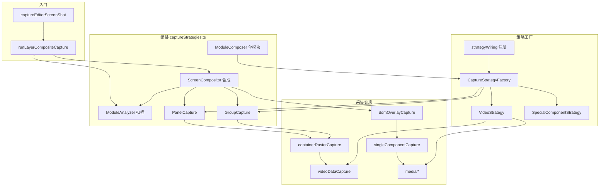

## 功能区关系图



---

## 模块加载接线（captureStrategies.ts 末尾）

```typescript
SingleComponentCapture = createSingleComponentCapture(ImageCaptureCore)
DomOverlayCapture = createDomOverlayCapture({ imageCapture, singleComponentCapture, getPanelCapture })
ImageCapture = bindImageCaptureDomDeps(ImageCaptureCore, DomOverlayCapture)
panelCaptureRef.current = PanelCapture
wireCaptureStrategies({ PanelCapture, GroupCapture, DomOverlayCapture, ImageCapture, Readiness, hostHasSpecialMarker })
```

**说明：** `ImageCapture` 与 `DomOverlayCapture` 通过工厂 + bind 打破循环依赖；`PanelCapture` 延迟注入供 `captureBaseExcludingPanels` 使用。

---

## 三种截图模式

| 模式 | 触发 | 路径 |
|------|------|------|
| **simple** | `screenShotMode: "simple"` | 整屏 snapdom，无分层 |
| **composite** | 默认 / `screenShotMode: "full"` | 扫描 → 多策略 → merge |
| **panelStitch** | `captureStrategy: "panelStitch"` | 面板独立层 + 底图 html2canvas |
| **single** | `captureStrategy: "single"` | 无面板时 snapdom 整屏 |

---

## ContentStrategies 注册表

`captureStrategies.ts` 中的 `ContentStrategies` 对象引用各采集实现：

| 键 | 实现 | 层级 |
|----|------|------|
| `singleComponent` | SingleComponentCapture | 单盒内容补丁 |
| `videoStream` | UeStreamCapture | UE 独立层 |
| `videoNormal` | VideoNormal | 普通 video |
| `chart` | ChartCapture | ECharts 快照 |
| `image` | ImageCapture | 纯图栅格 |
| `textDom` | FontDomCapture | 文本 flatten |
| `domOverlay` | DomOverlayCapture | html2canvas 盒/层 |

---

## 策略原理概要

详细机制见 [机制与引擎](./04-principles-and-engines.md)。

| 策略 | 核心文件 | 一句话 |
|------|----------|--------|
| Video 数据层 | `videoDataCapture.ts` | 从 componentList URL 离屏抓帧 |
| 面板/组栅格 | `containerRasterCapture.ts` | 按 panelData/children 坐标离屏 drawImage |
| DomOverlay | `domOverlayCapture.ts` | sanitize → html2canvas + onClone 补丁链 |
| 纯图 | `imageCapture.ts` | 直接 drawImage img/bg，失败才 dom 回退 |
| 特殊组件 | `specialComponentStrategy.ts` | 独立栅格后从 overlay exclude |
