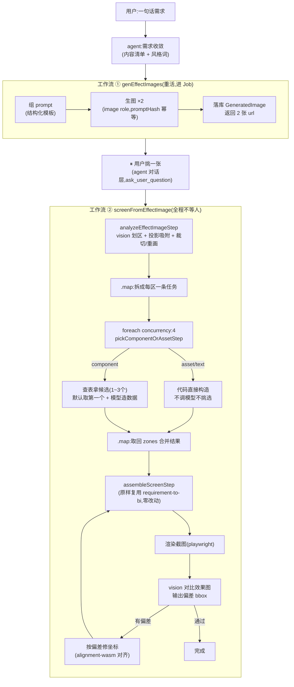

# 生图 → 大屏 工作流设计

> 状态:**流程已定,细节待定**。带 `TBD` 的地方是有意留空的,实现到那一步再补。
> 对应 21 天计划 W2(D8–D14)。相关先例:`requirement-to-bi`(从零建屏)、`figma-to-bi/semantic-layout`(vision 分区)、`src/jobs/`(JobRunner)。

---

## 0. 一句话

用户一句需求 → 生 2 张效果图 → **⏸ 挑一张**(唯一的人工节点)→ 划区 + 吸附 + 裁切/重画 + 选组件造数据 + 组装落屏,一条工作流走完 → 渲染自检。

效果图**只供布局与风格**;图里的假数字一律丢弃,数据走 `requirement-to-bi` 的数据链(W3 再合流)。

> **2026-09-17 更新**:②③ 已经不是"两段独立工作流 + 中间一个 ⏸"了——组件范围收窄到 4 类之后,选组件不再需要问用户(候选就 1~3 个,默认取第一个,用户事后用已有的改组件工具调整即可),于是 ②③ 合并成**一条工作流**,而且大量复用 `requirement-to-bi` 现成的 step 和类型,新写的代码很少。骨架已经打在
> `servers/server/src/mastra/workflows/screen-from-effect-image/`。§3.5 是复用矩阵,§8 是文件清单。

---

## 1. 全景图



---

## 2. 为什么最终只剩一个 ⏸,②③ 能合并成一条工作流

沿用 `requirement-to-bi` 已经踩出来的原则:

> 需求收敛与 `ask_user_question` 确认留在对话层(主 agent)做,不进工作流。工作流只负责确认之后那段确定性的重活。

**"挑效果图"是真正的人工判断**(风格好不好看,只有人能定),留在对话层:agent 调 ① 拿到 2 张图,用 `ask_user_question` 等用户选,再把 `imageId` 传进 ②。

**"挑组件"最初也设计成一个 ⏸,后来发现不成立**:参考现成的 `pick-components-step.ts`(116 个组件的全库检索)本身就是全自动选型、从不问用户;组件范围收窄到 4 类之后,数据区的候选集进一步收窄到 1~3 个(§3.5),挂起等一个几乎没有决策空间的选择,成本比"用户事后用已有的改组件工具调整"更高。于是 ②③ 之间**不再需要挂起**,合并成一条工作流 `screenFromEffectImageWorkflow`,内部结构直接照抄 `requirement-to-bi-workflow.ts` 的链式写法(`.then → .map → .foreach → .map → .then`)。

好处仍然成立:
- 工作流内部没有挂起状态,重试/恢复只需要考虑机器故障;
- `analyzeEffectImageStep` 的产物形状对齐 `composeLayoutStep`,以后 Figma 导入、用户上传截图想复用这条后半段链路时接口是稳的;
- 大量 step 和类型是**原样复用**,不是"参考着重写"——见 §3.5。

**"Job 里不能等人"**原则不变:JobRunner 只管 ① 的生图和 ② 里的重画 fan-out,这两处慢、会失败、要重试。

---

## 3. 各段的输入 / 输出契约

### ① genEffectImages

| | |
|---|---|
| 输入 | `contentItems`(复用 `requirement-to-bi/types.ts` 的内容清单)、`styleHint`(风格词,只喂生图不喂组件)、`canvas {w,h}`、`count=2` |
| 输出 | `GeneratedImage[]`:`{id, url, promptHash, seed, model, width, height}` |
| 模型 | AiModel 新增 `image` role(D8,已完成) |
| 幂等 | `promptHash = sha256(结构化 prompt + seed + model)`,命中直接返回(D8,已完成,`image-generation.server.ts`) |
| 重活 | 进 JobRunner,type=`image.generate`,handler 内并发 2 张(D9,待做——依赖 JobRunner 的 TODO 先填完) |
| prompt | 结构化模板:画布 / 风格 / 布局 / 区域内容 / **文字白名单** / 禁止(D10,见 §5) |
| 降级 | 生图失败 → agent 回落 `requirement-to-bi` 纯文本链路 |

**2026-09-17 实测跑通的生图服务**:豆包 seedream,走火山方舟(ARK)的 OpenAI 兼容端点。
Base URL `https://ark.cn-beijing.volces.com/api/v3`(**不带** `/images/generations`——ai-sdk 会自己拼这段路径,填全路径会拼出重复的 `/images/generations/images/generations`,踩过);
模型 ID `doubao-seedream-5-0-pro-260628`。
**已知约束**:该服务商要求图像面积至少 921600 像素,尺寸太小的请求会被直接拒绝——
生成小尺寸装饰素材(比如单独的背景平铺块)时不能直接按最终尺寸请求,得生大图再裁,
这一点在 D10 定生图尺寸策略时要考虑进去。

**TBD**:参考图库(img2img)怎么选、seed 是否暴露给用户重摇。

### ②③ screenFromEffectImage(analyzeEffectImage + pickComponentOrAsset + assembleScreen)

| | |
|---|---|
| 输入 | `imageId`(用户选中的那张)、`screenId`、`canvasWidth/Height` |
| 输出 | `LayoutSkeleton`(见 §4,现拆成 `analyzeEffectImageStep` 的 `zones`+`resolved` 两个数组)最终落到 `assembleScreenStep` 的 `{screenId, zoneCount, componentCount, skipped}` |
| vision 划区 | 复用/扩展 `figma-to-bi/semantic-layout/analyze-screen-regions-step.ts`:已有 0~1000 归一化 bounds、confidence、面积/包含清洗。要扩的是 `kind` 三分类 + `has_baked_text` |
| 去重 | **先分组再吸附**:同 `role`(如 `card-frame`)且尺寸比例相近的区域视为"同款",只挑一个代表做精细处理,其余全部 `asset.reuseOf` 指过去(见下"同款去重") |
| 吸附 | **已落地版本不做**(`snap` 恒为 `none`):代表走生图,vision 的粗略框只用来裁参考图和摆放,精度够。`snapBorder` 等原型留在 scratchpad,只给以后"必须保留原图内容"的区域用 |
| 裁切/生成 | 代表区域**优先生图,不硬抠**:`card-frame` 这类纯装饰背景直接拿"把留白描述成实体"的 prompt 生成一张干净空白底图,不从原图裁——裁图要跟"这条线是不是真边框"死磕(今天验证过这个判别力做不准),生图不需要,直接画一张四角切角的空面板,更快也更稳。原图裁切(`sharp.extract` + `dest-out` 挖空)只留给确实需要保留原图内容的区域(比如带真实数据形状的地图底图)|
| 重画 | 只对 `has_baked_text=true` 且不属于任何去重组的素材单独处理;进 JobRunner,type=`image.regenerate-asset`,fan-out 并发 |
| 文字区 | OCR → 富文本组件(D12 演示版可先跳过,用占位) |
| 数据区 | 只留 bbox + kind,图里内容丢弃;组件范围**收窄成固定的 4 类**(见下),不做全库向量检索 |

**2026-09-17 组件范围收窄**:这条链路不接 `pick-components-step` 的全库向量检索(那是 `requirement-to-bi` 白手起家建屏用的,116 个组件里选)。生图链路的区域已经有真实的视觉形态(卡片/图表/表格/文字/装饰),不需要再猜——直接收窄成 4 类:

| kind | 落什么 | 怎么定 |
|---|---|---|
| 图表 | **部分图表**(小候选集,非全库检索) | vision 给的 `contentKind`(kpi/trend/rank/share/map…)直接查表映射到候选 prop,不再 embedding 检索。候选集范围 TBD(先给折线/柱状/饼图/KPI 翻牌这几个高频型) |
| 富文本 | 富文本组件 | 文字区(标题、说明)一律走这个,不分详细类型 |
| 表格/列表 | 轮播表格 | `list` kind 唯一映射目标 |
| 装饰图/背景/边框 | **图片组件(`ft-img`)** | **不经过挑选**——kind=asset 的区域,裁切或重画出来是什么就直接用什么,素材识别完直接落地,没有"选组件"这一步 |

也就是说 ②的产物里,`kind=asset` 的区域**没有候选、没有挑选环节**,`asset.croppedUrl`/`regeneratedUrl` 直接就是最终要用的图;只有 `kind=component` 的区域才需要在 ③ 之前决定用哪个(且候选集是查表,不是检索)。

**TBD**:vision 的 `contentKind` 与查表映射的具体候选 prop 列表;OCR 用 vision 直接读还是单独模型。

**2026-09-17 同款去重(取代"吸附失败怎么办"这个 TBD)**:效果图里同一批卡片的背景框视觉上完全一样,只是尺寸不同——没必要把每一张都当成独立的抠图/吸附目标去死磕。改成:

1. vision 划区后先按 `role` + 宽高比分组(同 `role` 且长宽比接近视为同款);
2. 每组只挑**一个代表**做精细处理(生图或吸附裁切),其余成员的 `asset` 字段直接 `reuseOf` 指向代表,自己的 `box` 只用于摆放和九宫格拉伸,不要求像素级精确;
3. 这样"吸附精度不够"的风险被摊薄到只影响一个代表,而且代表优先选**生图**(见上表),连吸附判别力不足的问题都绕开了——生图这条路唯一还依赖像素分析的是给生图定宽高比,而这个精度要求远低于"扣出完整内容不能削边",vision 的粗略框就够用,不需要吸附去修。

这条原则本来在 9 月 16 号就定了("同款只画一张复用"),当时只用在 `has_baked_text` 触发的重画上;这次把它扩大成**所有视觉相同的装饰背景都按这条走**,不等到"因为有文字要重画"才去重。

**2026-09-17 三类素材的优先级(资源/时间不够时先保什么)**:`kind=asset` 里不是所有 `role` 一样重要,按落地优先级排:

1. **底图**(`role=background`,整张画布的底色/渐变/发光装饰,不含任何卡片框):最重要,决定大屏"看起来对不对"的第一印象,且**只需要生一张**,不参与"同款去重"分组——它本来就是全图唯一的一份,直接铺满 canvas 当最底层。
2. **标题图片**(`role=title-bar`):次重要,通常也只有一份(除非效果图里标题栏本身不是重复元素)。
3. **框框图片**(`role=card-frame`/`outer-frame`,即"同款去重"分组里的代表):重要度在这三个里最低,因为哪怕吸附/生成有点瑕疵,重复贴 6 遍的观感也比底图/标题出错更能容忍。

这个优先级用来指导 D11 若时间不够时的取舍顺序,以及 prompt/吸附参数调优精力的分配——不是说底图不用生图/框框可以糊弄,而是当只能保证一件事做对时,先保底图。三者在代码里走的仍是同一套"kind=asset → 分组(底图/标题各自成组,通常组内只有 1 个成员)→ 代表精细处理"逻辑,不需要为底图/标题单独开分支。

**2026-09-17 已跑通(`pnpm smoke:effect-image <imageId>`)**:拿真实生图(防汛大屏 1920×1080)跑完整链路 77s,22 个组件全部落地、0 跳过——底图 1 张生图、7 张卡片框只生 1 张其余 `reuseOf`、7 个图表按 contentKind 查表并由模型造数据、7 条标题落成富文本。落地时改掉的假设:

- **卡片框不按宽高比分组,按 role 一组**(第一版按比例分成 6 组、生了 6 张几乎一样的图);代表取宽高比居中的成员,拉伸失真最小。只有 `decoration` 还按比例细分。
- **底图不由 vision 给**:代码固定合成一条铺满画布的 `background` 区域,永远排 zones 第一位(z 序最底)。
- **img2img 不能走 ai-sdk**:它的 OpenAI provider 一带图就改请求 `/images/edits`,火山方舟没有这个端点(404)。`image-generation.server.ts` 对带参考图的请求直连方舟的 `/images/generations` + `image` 字段。方舟另有两条限制:`seed ≤ 2^31-1`(sha256 取 32 位要 `& 0x7fffffff`)、参考图宽高比 ≤ 16(标题栏 22:1 要把裁切框在原图里向外扩到 16:1)。
- **vision 提示词里不能提像素尺寸**:写了 1920×1080 模型就按像素给坐标,整批越界被 schema 拒。
- `kind=text` 的文字直接由 vision 读(`text` 字段),不另上 OCR;大屏标题/卡片页签这种大字够用。
- **一张卡片一个分组**(2026-09-17 第一次上真实画布后改的):第一版每个区域各自成组,拖一下卡片就散架;现在卡片框是容器,页签条/标题/图表按包含关系(被框盖住 ≥70%)归进同一个 `sw-folder`,组内 items 顺序 = 叠放顺序(框 → 页签条 → 文字 → 图表)。不在任何卡片里的(底图、顶部标题栏、大屏标题)各自成组。
- **z 序必须后端显式给**:Module 模板出来 `zIndex` 一律 0,前端 upsert 不重算,28 个组件谁盖谁全看运气(标题全被卡片框挡住、底图压在最上面)。`assembleScreenStep` 现在按发帧顺序单调递增写 `zIndex`,`requirement-to-bi` 同样受益。
- **页签条(card-title-bar)程序兜底**:vision(gemini flash-lite)指令里点名要也经常不给,卡片有标题却没页签条时按标题文字框向外扩一圈合成一条,去重后照样只生一张。
- **底图参考图先糊掉**:整张效果图直接当 img2img 参考,模型会忠实复刻所有卡片和文字(电力大屏实测生出一张乱码复印件);缩 1/4 + 高斯模糊后只剩色调与光效走向,生出来才是干净底图。
- **生图请求全部直连、`response_format: "url"`、请求与下载各自重试 3 次**（2026-09-17 晚）：中间隔着代理（TUN fake-ip 198.18.x）时 30~60s 的长连接经常被掐——请求阶段 `fetch failed (other side closed)`（58KB 的请求体也中）、响应阶段 statusCode 200 但 300KB 的 b64 体读到一半断。改成回直链（几百字节）再单独下载；每次 `Connection: close`；4xx 不重试。文本生图也不再走 ai-sdk：它的 provider 对 seedream 丢 `seed`（"seed is not supported"），幂等键形同虚设。环境侧建议把 `ark.cn-beijing.volces.com` 加进代理直连规则。
- **参考图走 JPEG、长边 ≤1280**:1MB 的 PNG 参考图 base64 进请求体,方舟直接断连(`fetch failed`);压到 100KB 级就稳了。参考图文件名带内容 hash,否则 url 不变会命中按旧参考图生的幂等结果。
- 真实组件名:图片 `swimg`(url 放 `data[0].value`)、富文本 `swRichtext`(`option.content`)、轮播表格 `swScroll`、翻牌器 `swFlopPerformance`、地图用「中国2.5D地图」(2D 那个模板过不了 schema 校验)。

**2026-09-17 第二轮(电力大屏 screen_23)修的四件事**——结构对了之后暴露出来的内容层问题:

- **素材必须自己带 alpha**:生图模型只出不透明图,prompt 写"透明"没用;卡片框裁切框是矩形,斜切角外那块底落到画布上就是死黑压底图。`steps/knock-out.ts` 对底图以外的素材做 GIMP color-to-alpha:底色取整图中位色(框线光效只占少数像素),**只算比底色亮的方向**(双向算的话深色底通道值≈40,暗 10 就是 25% 不透明,整块填充抠成雪花),先 0.8σ 模糊压噪,alpha<0.18 归零再平滑抬升。prompt 同时要求"素材以外是纯黑均匀底"方便抠。抠失败退回不透明原图。
- **铺满画布的素材当背景丢掉**(`MAX_ASSET_CANVAS_COVERAGE = 0.85`):vision 把整个画面框成一条 `outer-frame`,生出来的不透明图把真正的底图整个盖掉,还带进了它幻觉的大发光括号。底图只保留代码合成的那一条。
- **系列名/配色由代码写,不让模型填**(`steps/chart-theme.ts`):echarts 组件图例读的是 `seriesTabsName[i].value`,与 `dataSeriesName[i]` 按下标对应——模型只改 data 里的 `seriesName`,图例就还是模板的「系列一」。现在按 data 实际系列重写这三个数组,单系列关图例;vision 额外输出 `palette`(效果图主色 1~6 个 #rrggbb),代码按 prop 写进 `seriesLineColor/seriesItemColor/seriesColor(+picker 字符串)`、饼图按行、翻牌器数字色;翻牌器 `prefixText` 清空(卡片标题已是独立富文本,不然两行标题)。
- **component 区域带 `chart` 规格,不再只有一个 `contentKind`**(2026-09-18):`{ variant, smooth, series, seriesCount, xLabels, yRange, yAxisName, unit, showLegend, showLabel }`,全是效果图上写着的。第一版只给 `trend` 等于让造数据的模型盲造:12 个 x 刻度造成 8 个、0~3000 造成 2450~4680、五条线造成一条、面积图落成普通折线。现在 `variant` 一对一查 `CHART_VARIANT_TABLE`(line/area/bar/grouped-bar/stacked-bar/horizontal-bar/pie/ring/gauge/scatter/radar/funnel,都核对过模板与 propSchemaMap;`ring` 落饼图,「环形图」echartring 是单值进度环),`series/xLabels/yRange/unit` 写进造数据提示词当硬约束,`smooth/showLabel/showLegend` 由 `chartThemePatch` 写成按系列下标的布尔数组。同一份规格将来也是 echartcommon(自定义 echarts)路线的输入。生成图常见「图例 4 项画 5 条线」,所以 `series` 和 `seriesCount` 都要,以 `series` 为准。

**组装**:直接复用 `requirement-to-bi/steps/assemble-screen-step.ts`,零改动。它按中文名查 `Module` 表拿模板,不关心业务类型——"图片组件"和"条形图"走的是同一条 `loadBusinessComponent` 路径,只要 `pickedComponentSchema` 里的 `componentName`/`data`/`option` 填对,组装这层完全不用感知"这是不是一张图"。九宫格拉伸、素材 `safeArea` 这类图片特有的处理,发生在 ② 的 `resolved.asset` 里,组装时已经是拿现成的 url 直接落组件,不需要单独的"素材垫底"分支。

**自检**(D13 再补,现在的骨架里还没有):playwright 渲染截图 → vision 对比效果图 → 输出 `{regionId, deltaBbox}` → `alignment-wasm` 对齐 → 再 sync。**最多 2 轮**,不收敛就带 warning 返回。

**TBD**:自检的对比 prompt;是否让用户看到"修正前/后"。

### 3.5 复用矩阵(2026-09-17 定)

对照 `requirement-to-bi` 现成的四块(`types.ts` / `compose-layout-step.ts` / `pick-components-step.ts` / `assemble-screen-step.ts`),能不能复用逐一核对过:

| 现成的东西 | 处理方式 | 理由 |
|---|---|---|
| `types.ts` 的 `Rect` / `SolvedZone` / `SolvedItem` / `ContainerKind` / `resolveContainerKind` | **原样复用** | 纯结构契约,跟坐标怎么来的(网格求解 or 像素吸附)无关 |
| `pick-components-step.ts` 的 `zoneTaskSchema`(仅借鉴形状,新建 `regionTaskSchema`)/ `pickedComponentSchema` / `zoneComponentsSchema` | **schema 原样复用** | 这三个只描述"选完长什么样",不含"怎么选"的逻辑 |
| `assemble-screen-step.ts` **整个文件** | **零改动复用** | `loadBusinessComponent` 是按中文名查 `Module` 表的通用路径,图片组件和图表组件走同一条路,不需要专门加"素材垫底"分支 |
| `compose-layout-step.ts` | **不复用,换新 step**(`analyzeEffectImageStep`) | 它的活是"模型编格子 + solveLayout 求坐标",图片路径的坐标是吸附出来的真实像素,不需要编 |
| `pick-components-step.ts` 的 `searchCandidates`(向量检索)+ 主循环调 agent 生成 data | **不复用,换新 step**(`pickComponentOrAssetStep`),但复用它的输出 schema 与数据生成+校验+重试的写法 | 全库检索太重,4 类里选不需要 embedding,换成查表 |

关键推导:`kind=asset`/`kind=text` 的区域**不需要挑选环节**,不是因为"没有候选去挑",而是因为它们在 `pickComponentOrAssetStep` 里被**代码直接构造成一条 `pickedComponentSchema`**(`componentName` 写死"图片"/"富文本",`option` 里塞裁切/OCR 结果),对 `assembleScreenStep` 来说和"模型选出来的图表"长得一模一样。三类(图片/富文本/图表)在下游没有区别。

---

## 4. 中间格式 `LayoutSkeleton`(② 的产物,③ 的输入)

```ts
type LayoutSkeleton = {
  source: { imageId: string; width: number; height: number };
  canvas: { width: number; height: number };
  regions: Region[];
};

type Region = {
  id: string;
  kind: "component" | "asset" | "text";
  /** 语义角色:card-frame | outer-frame | title-bar | center-decoration | background-tile | kpi | trend | ... */
  role: string;
  /** vision 原始框(0~1000 归一化),留着对账 */
  rough: [number, number, number, number];
  /** 吸附后像素框 [x1,y1,x2,y2],原图坐标 */
  box: [number, number, number, number];
  snap: "border" | "extent" | "cleanest" | "none";
  confidence: number;

  // kind = asset
  // kind = asset:裁完/画完就是最终结果,**没有挑选环节**,直接落地当 ft-img
  asset?: {
    croppedUrl: string;          // 直接裁切结果
    hollowInset?: number;        // 有则为空框
    hasBakedText: boolean;
    regeneratedUrl?: string;     // 重画结果(有则优先)
    safeArea?: [number, number, number, number]; // 组件可放区域,相对 box
    reuseOf?: string;            // 同款复用哪个 region 的素材
  };

  // kind = component:候选集是**查表**,不是全库向量检索(见 §3②「组件范围收窄」)
  component?: {
    contentKind: ContentKind;    // 对齐 requirement-to-bi 的 contentKindSchema
    componentClass: "chart" | "richtext" | "carousel-table"; // 4 类里去掉 image 的其余 3 类
    candidates: string[];        // 查表得到的候选 prop,通常 1~3 个,供 ⏸ 挑选或直接取第一个
    contentItemId?: string;      // 匹配到的内容清单项
  };

  // kind = text
  text?: { value: string; confidence: number };
};
```

对应今天实验里 `images/assets/manifest.json` 的字段(`name/role/snap/rough/box/delta`),多了 kind 分流和素材/组件的附属信息。

> 骨架代码里这份契约拆成了两半:`analyzeEffectImageStep` 产出 `zones: SolvedZone[]`(结构,原样对齐 `composeLayoutOutputSchema`)+ `resolved: ResolvedRegion[]`(每个 zone 对应一条,带 kind/snap/box/asset/text 这些图片路径特有的信息),而不是一个大而全的 `Region[]`——这样 `zones` 能直接喂给下游原样复用的 `.foreach`/`assembleScreenStep`,不用现造一层转换。类型定义在
> `servers/server/src/mastra/workflows/screen-from-effect-image/types.ts`。

---

## 5. 已验证的经验(2026-09-16,豆包实测)

- **裁切为主,重画为少数**:一张效果图里只有"有烤死文字"的区域需要重画;外框、HUD、底部装饰 sharp 直接裁。
- **同款素材只画一张**:六张卡片同款 → 一张空卡片底图复用,九宫格适配。
- **把留白描述成实体**:"主体是一块完整均匀的纯色面板,只有一圈外轮廓线,内部不能出现第二圈线框",比堆否定词有效。
- **参考图只传裁下来的小块**,不传整张大屏。
- **效果图 prompt 结构化**:画布 / 风格 / 布局 / 区域内容 / 文字白名单 / 禁止。
- **吸附算法 10/10 命中**:粗略框偏 10~40px 时,border/extent/cleanest 三种模式全部吸回正确边;两组差别很大的粗略输入收敛到相同结果。已知限制:深底亮线假设、`gapMin=60` 经验值、搜索窗 ±40px。
- 豆包免费版右下角有水印,裁切要预留边距或改无水印源。

## 6. 借鉴 screenshot-to-code 的三点

1. vision 输出 **0~1000 归一化坐标**,裁切时左上 `floor`、右下 `ceil` 向外取整保边。
2. 喂模型前做像素归一化(EXIF、统一 PNG),保证模型看到的和裁的是同一份像素——接用户上传截图时必需。
3. **渲染截图回喂模型自检**(他们的 `screenshot_preview`),这是 ③ 的自检闭环来源。他们停在 vision bbox 直接裁、靠 prompt 补偿偏差;我们多一层投影吸附,更稳。

## 7. 排期映射(W2)

| 日 | 落什么 |
|---|---|
| D8 | AiModel `image` role + `GeneratedImage` 表 + promptHash |
| D9 | JobRunner 接 Prisma store;`image.generate` handler;SSE 进度;工作流 ① |
| D10 | 结构化 prompt 模板 + 参考图 + seed;`asset-crop` 模块落地(吸附三模式 + 单测,用今天的图当 fixture) |
| D11 | 工作流 ②:vision 划区扩 kind/hasBakedText → 吸附 → 裁切 → 重画 fan-out |
| D12 | 工作流 ③ 组装落屏(占位数据)+ **可演示**;自检先只截图不修正 |
| D13 | WAL/事务/乐观锁(重日);自检修正回路 |
| D14 | 阶段交付 + env 白名单 |

D12 演示版跳过:组件底图 fan-out、OCR 文字区、自检修正。

---

## 8. 落地文件(骨架已打,TODO 待填)

`servers/server/src/mastra/workflows/screen-from-effect-image/`:

| 文件 | 状态 |
|---|---|
| `types.ts` | 完整:`effectImageRegionSchema`/`ResolvedRegion`/`CHART_CLASS_TABLE` 等,含待核对的 TODO(组件 prop 拼写、`Module.name` 是否精确匹配) |
| `steps/analyze-effect-image-step.ts` | **完整**:按 id/url 取 `GeneratedImage` → `effectImageAnalyzerAgent` 划区(专用 vision agent,不复用 semanticLayoutAgent——那个禁止嵌套)→ `normalizeEffectImageRegions` 清洗(包含关系只在 component 间去重)→ 合成 background → 分组生图 |
| `steps/resolve-assets.ts` | **完整**:`groupAssetRegions` / `fitGenerationSize` / `produceRepresentativeAsset`(裁参考图 → img2img → 失败降级为裁切) |
| `steps/pick-component-or-asset-step.ts` | **完整**:asset/text 代码直接构造;chart 查表 + `screenComposerAgent` 造数据 + `checkDataKeys` 校验重试,两轮不对齐就用模板默认数据落地(不丢区) |
| `agents/effect-image-analyzer-agent.ts` | 划区 agent 的指令:三类区域的判别规则、role 白名单、"不要输出整屏背景" |
| `scripts/smoke-screen-from-effect-image.ts` | 冒烟脚本,`pnpm smoke:effect-image <imageId>` |
| `screen-from-effect-image-workflow.ts` | 完整:`.then(analyze).map().foreach(pick).map().then(assembleScreenStep)`,`assembleScreenStep` 直接从 `requirement-to-bi` 原样 import,零改动 |

`①genEffectImages` 尚未开工(D9),不在这次骨架里。

已跑过 `tsc --noEmit` 与 `eslint --fix`,骨架本身类型与格式都是干净的。
