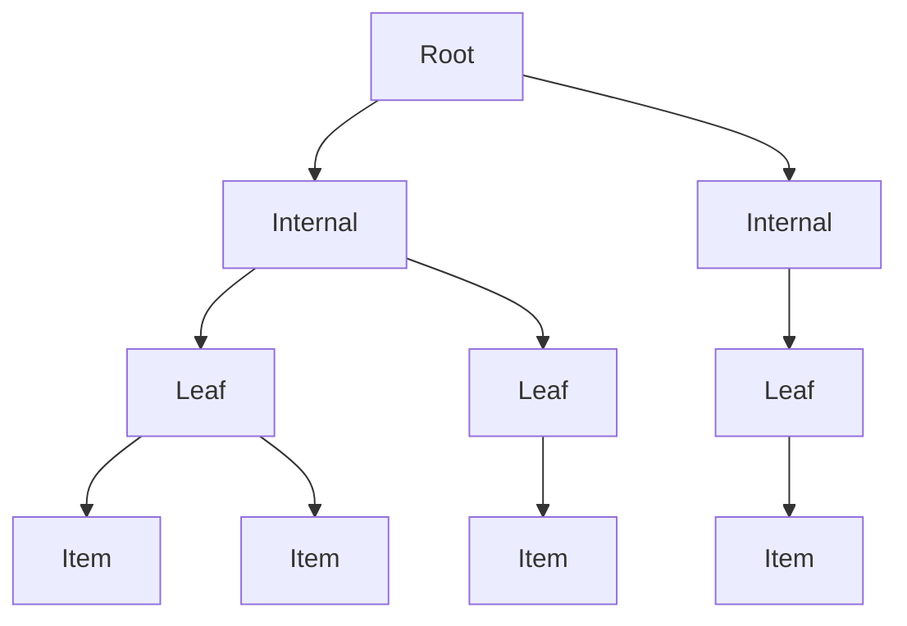

## R 树与 `rbush.ts` 实现详解

### 目标与范围
- **目标**: 系统介绍 R-tree（R 树）数据结构及其核心算法，并结合 `rbush.ts` 的具体实现细节进行说明。
- **范围**: 数据结构、不变式、查询与碰撞、单条插入、批量构建（STR/OMT）、节点分裂、删除与压缩、几何工具、复杂度与调优。

---

## 概述

- **R 树是什么**: 一种层次化空间索引结构，用最小包围矩形（MBR）组织二维空间中的点或矩形，使范围查询与碰撞检测高效。
- **核心思想**: 以父节点的矩形包裹所有子项，利用几何剪枝（相交/包含）减少遍历量，降低查询复杂度。
- **典型应用**: 地图与GIS、游戏碰撞检测、CAD与可视化等。



---

## 数据模型与不变式

- **数据结构**
  - **`BBox`**: `{ minX, minY, maxX, maxY }`，表示对象或节点的边界框。
  - **`RBushNode<T>`**: 树节点，既可以是叶子（`leaf = true`，`children` 为数据项）也可以是内部节点（`leaf = false`，`children` 为子树）。
  - **`RBush<T>`**: 树主体，包含根节点 `data`、参数 `maxEntries`（默认 9）与 `minEntries`（默认约 40% 填充）。
- **关键不变式**
  - **覆盖性**: 父节点的 `BBox` 必须覆盖所有子项的 `BBox`。
  - **层级性**: 叶子高度为 1；内部节点高度为子节点高度 + 1。
  - **容量约束**: 每个节点的 `children.length` 应在 `[minEntries, maxEntries]` 范围（根节点在初始化或批量构建时可特例）。
  - **路径维护**: 插入与删除时需维护从根到目标的路径以回溯调整 `BBox`、进行分裂或压缩。

---

## 核心操作与算法

### 范围查询：`search(bbox: BBox): T[]`

- **目标**: 返回与查询框相交的所有数据项。
- **流程**
  - 若根与查询框不相交，返回空。
  - 维护栈进行遍历：
    - 叶子节点：对每个数据项做 `intersects` 测试，相交则加入结果。
    - 内部节点：若查询框完全 `contains` 子节点 `BBox`，则整子树直接收集（剪枝加速）；否则，将与查询框 `intersects` 的子节点入栈。
- **实现要点**
  - 几何剪枝通过 `intersects(a, b)` 与 `contains(a, b)` 实现。
  - 全子树收集通过 `_collectAllItems(node, result)` 实现，避免逐项检查。

```mermaid
graph TD
S[Start: root intersects?] -->|No| E[Return []]
S -->|Yes| N[Scan children]
N --> L{Leaf?}
L -->|Yes| C1[Check item intersects]
L -->|No| C2[Child BBox relation]
C2 -->|Contained| A[Collect whole subtree]
C2 -->|Intersects| P[Push child to stack]
P --> N
C1 --> R[Add intersecting items]
R --> N
A --> N
```

- **复杂度**: 平均近似 O(log_M N + K)，其中 M 为分支因子，K 为命中数；最坏 O(N)。

---

### 碰撞检测：`collides(bbox: BBox): boolean`

- **目标**: 判断是否存在任意项与查询框相交。
- **流程**
  - 若根不相交，返回 `false`。
  - 遍历过程与 `search` 类似，但一旦在叶子层发现相交项，或内部层有子节点被完全包含，立即返回 `true`（早停）。
- **复杂度**: 平均 O(log_M N)，通常比 `search` 更快（早停）。

---

### 批量构建（STR/OMT）：`load(data: readonly T[])`

- **目的**: 从空树或小树中用大批数据构建近似平衡、重叠更小的树，通常比逐条插入快 2–3 倍，并提升查询性能。
- **算法思想**: Sort-Tile-Recursive（代码注释称 OMT，流程与 STR 相同家族）
  1. 若 `N <= M`（最大条目数），直接建叶子并计算 `BBox`。
  2. 首次进入时计算目标树高 `height = ceil(log_M N)`，并设定根的目标分支数 `M = ceil(N / M^(height - 1))`。
  3. 二次分块：
     - 按 `minX` 分组为大块：`N1 = N2 * ceil(sqrt(M))`；
     - 每个大块内按 `minY` 分组为小块：`N2 = ceil(N / M)`；
     - 对每个小块递归构建子树。
  4. 计算当前节点 `BBox` 并返回。
- **实现关键**: 使用 `multiSelect(..., compareMinX/compareMinY)` 借助 `quickselect` 做分组选择，避免全排序的高开销。

```mermaid
graph TD
B[Bulk build(items, left, right, height)]
B -->|N<=M| L[Leaf node]
B -->|N>M & height=0| H[Compute target height & M]
H --> X[Group by X into N1 tiles]
X --> Y[Within tile, group by Y into N2 blocks]
Y --> R[Recursively build subtrees]
R --> C[Compute BBox of node] --> O[Return node]
L --> O
```

- **复杂度**: 近似 O(N log N) 或更优（依赖 `quickselect` 的分块），整体优于逐条插入。

---

### 单条插入：`insert(item: T)`

- **目的**: 将单个数据项插入既有树，保持边界与重叠尽量优化。
- **流程**
  1. **选择子树**：`_chooseSubtree(bbox, node, level, path)`
     - 在每一层选择“面积扩张最小”的子节点，打平时选择“原面积最小”的子节点；
     - 路径节点压入 `path`。
  2. **插入与扩展**：将项插入选中节点，并 `extendBBox(node, bbox)`。
  3. **处理溢出**：若节点超过 `maxEntries`，调用 `_splitNode(path, level)`；根节点通过 `_splitRoot(...)` 分裂并树高 +1。
  4. **回溯调整**：`_adjustParentBBoxes(bbox, path, level)` 沿路径向上扩展父级边界框。

```mermaid
graph TD
I[Insert(item)] --> CS[_chooseSubtree]
CS --> P[Record path]
P --> INS[Append item; extend BBox]
INS --> OV{Overflow?}
OV -->|Yes| SN[_splitNode]
SN --> AR[_adjustParentBBoxes]
OV -->|No| AR
AR --> SR{Root split?}
SR -->|Yes| NR[New root] --> D[Done]
SR -->|No| D
```

- **复杂度**: 近似 O(log_M N)，分裂时包含排序/选择的额外开销。

---

### 节点分裂：`_splitNode` / `_splitRoot`

- **分裂轴选择**：`_chooseSplitAxis(node, m, M)`
  - 在 X/Y 两轴分别排序（叶子用 `compareMinX/compareMinY`，内部节点用节点版比较函数）；
  - 计算所有可能分布的总边距（`_calculateAllDistMargin`），选择总边距更小的轴（更能减少重叠）。
- **分裂点选择**：`_chooseSplitIndex(node, m, M)`
  - 遍历切分点 `i`（两侧至少保留 `m` 个）：
    - 计算左右 `BBox`；
    - 首要目标使“相交面积”最小（`calculateIntersectionArea`），打平时选择“总面积”最小。
- **根分裂**：溢出层级为 0 时 `_splitRoot(node, newNode)`，新建根并树高 +1。

---

### 删除与压缩：`remove(item, equalsFn?)`、`_condenseTree(path)`

- **删除流程**
  - 深度优先遍历，叶子层通过 `equalsFn` 或按引用查找目标项；
  - 找到后从叶子删除，路径压栈以便压缩。
- **压缩流程**
  - 自底向上：
    - 若某节点空：从父节点移除它；若为空的是根，调用 `clear()`；
    - 否则重新计算该节点 `BBox`。
- **复杂度**: 一般近似 O(log_M N)，与项位置和树结构相关。

---

## 几何与工具方法（`rbush.ts`）

- **几何判断**
  - **`contains(a, b)`**: a 完全包含 b？
  - **`intersects(a, b)`**: a 与 b 是否相交？
  - **`calculateArea(b)`**: 面积。
  - **`calculateMargin(b)`**: 边距（宽 + 高）。
  - **`calculateEnlargedArea(a, b)`**: 合并两框后的面积。
  - **`calculateIntersectionArea(a, b)`**: 相交面积。
- **边界框维护**
  - **`extendBBox(a, b)`**: 扩展 a 以包含 b。
  - **`calculateDistBBox(node, k, p, dest?)`**: 区间并集的 `BBox`。
  - **`calculateBBox(node)`**: 从子项汇总当前节点 `BBox`。
- **分组选择**
  - **`multiSelect(arr, left, right, n, compare)`**: 结合 `quickselect` 做分块选择，避免全排序；支撑 STR 构建中的 X/Y 分组。
- **序列化**
  - **`toJSON` / `fromJSON`**: 导出/导入树结构，便于持久化与网络传输。

---

## 复杂度与性能

- **查询/碰撞**: 平均 O(log_M N + K)，最坏 O(N)。剪枝效果越好越快。
- **单条插入**: 平均 O(log_M N)，分裂时包含选择与排序开销。
- **批量构建**: 近似 O(N log N) 或更优（依赖 `quickselect` 分块），通常比逐条插入快 2–3 倍。
- **删除**: 接近 O(log_M N)，压缩线性于路径长度。

---

## 调优与实践建议

- **参数调优**
  - **`maxEntries` 增大**: 插入更快、树更“胖”、查询路径变长，可能降低查询性能。
  - **`minEntries` ≈ 40% 填充**: 有利于分裂质量与平衡度（`rbush.ts` 默认约 0.4）。
- **构建策略**
  - 初始加载大量数据时优先使用 **`load`**（STR/OMT），可显著提升构建与后续查询性能。
- **自定义数据**
  - 若项不是 `BBox` 结构，可重写 **`toBBox(item)`**、**`compareMinX/compareMinY`** 以适配自定义类型（如点、线段等）。

---

## 与 `lib.rs` 的映射提示（不生成代码）

- **类型映射**: TS 的 `BBox` ↔ Rust 的 `BBox`（字段命名不同：`minX/minY` ↔ `min_x/min_y`）。
- **结构映射**: TS `RBushNode<T>` 的联合 `children` ↔ Rust 中 `RBushNode<T>` + `RBushEntry<T>`（`Data`/`Node` 枚举）。
- **算法对应**: `_chooseSubtree`、`_insertNode`、`_splitNode`、`_splitRoot`、`_adjustParentBBoxes`、`_buildTree`、`multiSelect` 在 Rust 中均需要对应实现或替代方案（如 `quickselect` 的 Rust 实现）。

---

## 术语速览

- **MBR**: Minimum Bounding Rectangle，最小包围矩形。
- **STR**: Sort-Tile-Recursive，批量构建算法（排序并分块递归）。
- **重叠最小化**: 分裂时首要优化目标，减少查询时的节点访问数量。
